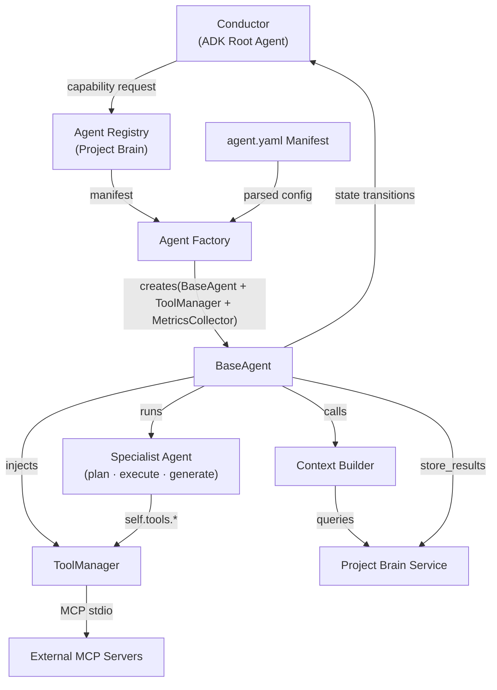
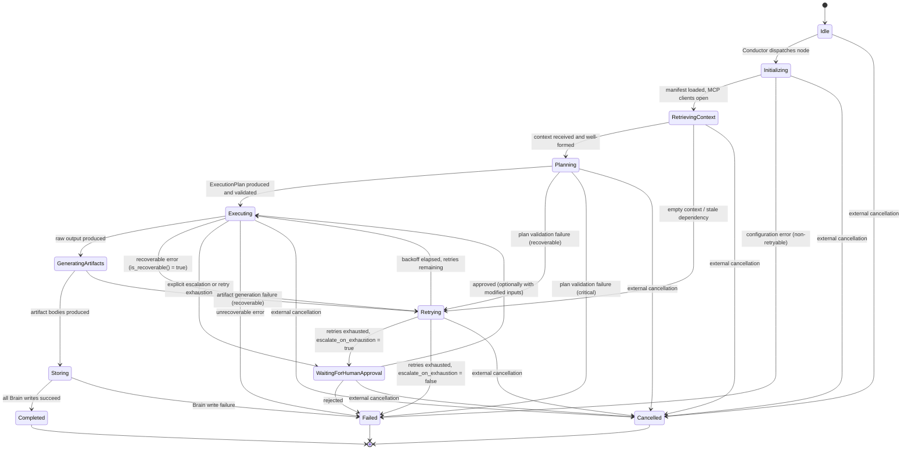
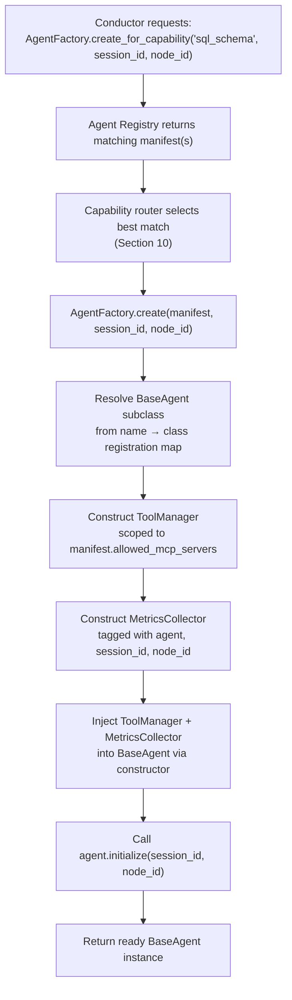
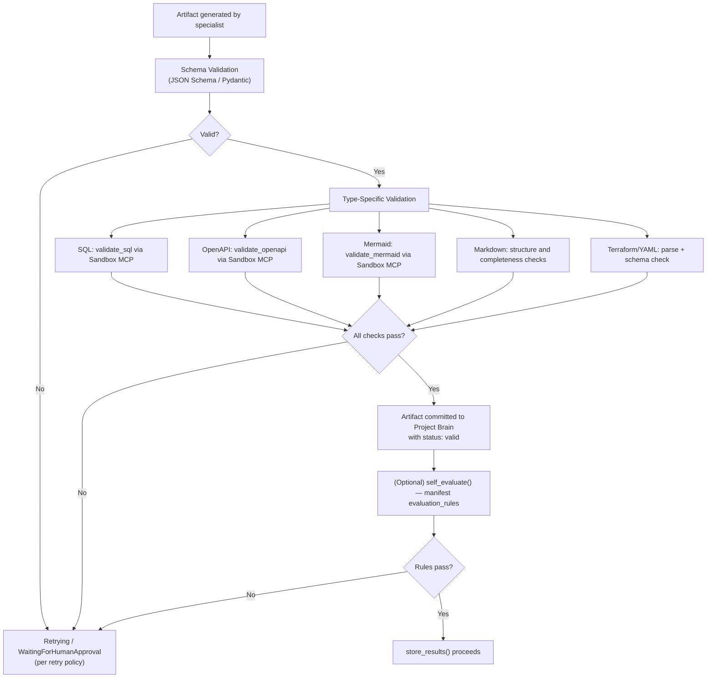

# AGENT_FRAMEWORK.md

Version: 1.0

Status: ✅ FROZEN

Owner: Orchestra AI

Last Updated: July 2026

Purpose

This document is the approved architecture specification for the Orchestra AI Agent Framework.

This document is frozen.

Implementation must follow this specification.

Major architectural changes require an Architecture Review before modification.

**Orchestra AI — Reusable Agent Framework Specification**

| Field | Value |
|---|---|
| Document path | `docs/architecture/AGENT_FRAMEWORK.md` |
| Status | ****Final**** |
| Version | 1.0.0 |
| Authors | Architecture Team |
| Last reviewed | 2025 |

---

## Table of Contents

1. [Purpose](#1-purpose)
2. [Design Goals](#2-design-goals)
3. [High-Level Architecture](#3-high-level-architecture)
4. [BaseAgent](#4-baseagent)
5. [Template Method Lifecycle](#5-template-method-lifecycle)
6. [Agent State Machine](#6-agent-state-machine)
7. [Agent Manifest](#7-agent-manifest)
8. [Agent Registry](#8-agent-registry)
9. [Agent Factory](#9-agent-factory)
10. [Capability-Based Routing](#10-capability-based-routing)
11. [Context Builder](#11-context-builder)
12. [Project Brain Integration](#12-project-brain-integration)
13. [ToolManager](#13-toolmanager)
14. [Skills](#14-skills)
15. [Generator-Critic Pattern](#15-generator-critic-pattern)
16. [Validation Pipeline](#16-validation-pipeline)
17. [Logging & Observability](#17-logging--observability)
18. [Error Handling](#18-error-handling)
19. [Extensibility](#19-extensibility)
20. [Design Patterns](#20-design-patterns)
21. [Production Considerations](#21-production-considerations)
22. [Future Enhancements](#22-future-enhancements)

---

## 1. Purpose

Orchestra AI transforms a single product idea into a complete software engineering blueprint — PRD, system architecture, database schema, OpenAPI specification, security review, infrastructure configuration, and technical documentation — through the coordinated work of multiple specialized AI agents.

Each specialist agent in the system performs exactly one engineering responsibility. A Planning Agent scopes the project. A System Architecture Agent designs the system topology. A Database Design Agent produces the schema. No agent performs two jobs; no agent communicates with another directly.

This document defines the **Agent Framework**: the shared architectural foundation that every specialist agent inherits. It specifies the lifecycle, interfaces, state machine, contracts, and cross-cutting behaviors — logging, error handling, tool access, context retrieval, artifact storage, evaluation — that apply uniformly across all agents, present and future.

The framework exists for two reasons:

**Consistency.** Without a shared foundation, nine specialist agents written independently will make nine different decisions about how to handle retries, how to write to Project Brain, how to format logs, and how to invoke tools. These divergences compound as the system grows. The framework enforces uniformity mechanically, not through convention.

**Thinness of specialist agents.** Every line of code inside a specialist agent that deals with infrastructure — MCP client management, retry loops, context retrieval, artifact versioning, logging — is a line that doesn't belong there. A specialist agent should contain almost nothing except domain knowledge: its system prompt, its planning logic, and its output generation. Everything mechanical lives in the framework. The practical test is that adding a new specialist agent should feel like writing a configuration file and a domain function, not building a new microservice.

---

## 2. Design Goals

### Consistency

All agents behave identically at the infrastructure level. Retry policies, logging formats, Brain interaction patterns, and state transitions are governed centrally. An operator monitoring two different agents should not have to learn two different logging schemas or two different error shapes.

### Modularity

Every framework component — `ToolManager`, `SkillLoader`, `MetricsCollector`, `ContextBuilder` — is a discrete, independently testable unit. Components are composed into the agent through dependency injection; no component reaches into another's internals. This means individual components can be replaced, upgraded, or mocked for testing without touching the rest of the framework.

### Extensibility

A new specialist agent requires exactly three steps: author an `agent.yaml` manifest, create a `BaseAgent` subclass implementing domain logic, and register the manifest. No existing component — Conductor, AgentFactory, ToolManager, Project Brain — requires modification. This is a hard architectural guarantee, not an aspiration.

### Separation of Concerns

The framework enforces a strict **mechanism/policy boundary**: the framework owns *how* things happen (tool access, retry execution, Brain writes, state transitions), and the specialist owns *what* happens (what to plan, what to generate, what counts as recoverable). A specialist agent that tries to manage its own MCP client, write directly to Project Brain, or override the lifecycle sequence is violating this boundary. The architecture should make these violations structurally impossible, not merely discouraged.

### Observability

Every execution produces a structured log and a parallel metrics record. Token usage, latency, retry count, estimated cost, and artifact sizes are captured automatically — not as optional instrumentation, but as a first-class output of every lifecycle run. A system that cannot account for its own resource consumption is not production-ready.

### Reliability

Transient failures are handled by the framework. Specialist agents declare what counts as recoverable for their domain; the framework executes the retry policy. Human-in-the-loop escalation paths are built into the state machine, not bolted on as an afterthought. Failures are audited, not silently swallowed.

### Scalability

The framework is designed so that adding agents does not require changes to existing components. Capability-based routing (Section 10) means the Conductor's complexity is constant regardless of how many specialist agents exist. The Project Brain's pluggable repository layer (SQLite today, PostgreSQL tomorrow) absorbs storage scaling without touching the framework.

---

## 3. High-Level Architecture

Orchestra AI is organized in four layers. The Agent Framework governs Layer 3 exclusively.

```
┌─────────────────────────────────────────────────────────────┐
│  Layer 1 — Client Studio                                     │
│  React UI · Visual DAG · Artifact Viewer · Approval Console │
└──────────────────────────────┬──────────────────────────────┘
                               │ REST / WebSocket
┌──────────────────────────────▼──────────────────────────────┐
│  Layer 2 — Orchestration                                     │
│  Conductor (ADK Root Agent)                                  │
│  ADK SequentialAgent · ParallelAgent · LoopAgent · Routing  │
│  ADK session.state (runtime)                                 │
└──────────────────────────────┬──────────────────────────────┘
                               │ ADK dispatch
┌──────────────────────────────▼──────────────────────────────┐
│  Layer 3 — Agent Ecosystem  ◄── THIS DOCUMENT               │
│                                                              │
│   BaseAgent  (framework)                                     │
│    ├─ ToolManager                                            │
│    ├─ ContextBuilder                                         │
│    ├─ SkillLoader                                            │
│    ├─ MetricsCollector                                       │
│    └─ AgentStateMachine                                      │
│                                                              │
│   Specialist Agents  (domain logic only)                     │
│    Planning · Architecture · Database · API Design           │
│    Security · DevOps · Documentation · [future agents]       │
└────────────┬────────────────────────────────────────────────┘
             │ Brain Service (internal)   │ MCP stdio
┌────────────▼───────────────┐  ┌────────▼─────────────────────┐
│  Layer 4 — Integration      │  │  External MCP Servers         │
│  Project Brain Service      │  │  Filesystem MCP               │
│  SQLite (MVP)               │  │  Developer Knowledge MCP      │
│  Agent Registry             │  │  Sandbox MCP                  │
└─────────────────────────────┘  └──────────────────────────────┘
```

### Agent Execution Flow



### What Flows Through the Framework vs. What Does Not

| Channel | What flows | Who manages it |
|---|---|---|
| ADK `session.state` | Runtime execution state (current node, retry count, approval flags, active workflow, temporary context) | ADK / Conductor |
| Project Brain Service | Persistent engineering memory (artifacts, decisions, evaluations, audit logs, agent registry) | BaseAgent (via `store_results`) |
| ToolManager → MCP | File I/O, code execution, reference lookups | ToolManager only |
| Agent-to-agent | Nothing — agents never communicate directly | Not permitted |

---

## 4. BaseAgent

### Responsibilities

`BaseAgent` is an abstract class and the root of the specialist agent hierarchy. Its responsibilities are mechanical by definition — anything requiring domain judgment belongs in the specialist:

- Bind to a session and node via `initialize()`.
- Retrieve and structure context from the Context Builder.
- Resolve and hold the `ToolManager` instance declared by the manifest.
- Lazily load declared skills.
- Execute the fixed ten-phase lifecycle via the Template Method (Section 5).
- Enforce state machine transitions (Section 6).
- Validate the specialist's `ExecutionPlan` against the manifest before execution begins.
- Normalize generated content into `Artifact` schema objects (checksum, versioning metadata, dependency graph).
- Batch-write artifacts, decisions, and audit records to Project Brain.
- Capture structured logs and metrics on every phase.
- Invoke `request_human_review()` when escalation conditions are met.
- Apply the retry policy from the manifest.
- Run `cleanup()` unconditionally on both success and failure paths.

### What Belongs Inside BaseAgent

- All MCP client lifecycle management (via ToolManager).
- All Project Brain write calls.
- All retry/backoff logic.
- All state machine bookkeeping.
- All structured logging and metrics emission.
- SHA-256 checksum computation and artifact version registration.
- Human review pause/resume mechanics.
- `ExecutionPlan` schema validation.

### What Belongs Inside Specialist Agents

- System prompt content.
- `plan()` implementation: given context, decide what this execution will produce and how.
- `execute()` implementation: carry out the plan using `self.tools.*` and loaded skills.
- `generate_artifacts()` implementation: transform raw execution output into artifact bodies.
- `is_recoverable(error)` override: domain-specific classification of what counts as a transient failure.
- `self_evaluate(artifacts)` override (optional): lightweight domain-specific output sanity check.
- Decision rationale and confidence scores.

### Protected Extension Points

| Method | Override required | Purpose |
|---|---|---|
| `plan(context)` | ✅ Required | Produce an `ExecutionPlan` given the retrieved context |
| `execute(plan)` | ✅ Required | Execute the plan, producing raw output |
| `generate_artifacts(raw)` | ✅ Required | Transform raw output into artifact content |
| `is_recoverable(error)` | Optional | Override to refine recoverability classification for this domain |
| `self_evaluate(artifacts)` | Optional | Add a domain-specific local sanity check beyond schema validation |
| `on_human_review_approved(outcome)` | Optional | React to approved review (e.g., incorporate reviewer annotations) |

`execute_lifecycle()` is explicitly `final`. Specialists may not override the lifecycle sequence.

---

## 5. Template Method Lifecycle

The `execute_lifecycle()` method defines a fixed ten-phase execution sequence. The BaseAgent owns the sequence; specialists override only the designated hooks. Every phase is timed and logged.

```
execute_lifecycle()
│
├── 1. initialize()
├── 2. retrieve_context()
├── 3. load_skills()
├── 4. plan()                ← specialist override
├── 5. execute()             ← specialist override
├── 6. generate_artifacts()  ← specialist override
├── 7. store_results()
├── 8. log_execution()
├── 9. [self_evaluate()]     ← optional specialist override
└── 10. cleanup()            ← always runs (finally block)
```

### Phase Descriptions

**1. `initialize(session_id, node_id)`**

Binds the agent instance to a specific unit of work. Loads and parses the `agent.yaml` manifest from the Agent Registry. Constructs the `ToolManager` scoped to the manifest's `allowed_mcp_servers`. Constructs the `MetricsCollector` tagged with agent name, session ID, and node ID. Opens MCP client connections declared in the manifest. Validates that required input artifact types exist in the current session before proceeding (fails fast here rather than mid-execution). Initializes the state machine to `Initializing`. This phase must complete without retry — a failure here indicates a configuration problem, not a transient one, and should transition directly to `Failed`.

**2. `retrieve_context()`**

Calls the Context Builder (Section 11) to fetch a pre-filtered context block from Project Brain. Returns a typed `AgentContext` object containing structured fields — `.decisions`, `.artifacts`, `.task_instruction`, `.raw_markdown` — rather than exposing raw markdown to specialist code. Context is retrieved once and reused across retries unless the failure is specifically a stale-context failure. Transitions the state machine to `Retrieving Context`. An empty context response when the manifest declares required inputs is itself a recoverable error, routed to `Retrying` rather than `Failed`.

**3. `load_skills()`**

Resolves skill names declared in the manifest into loaded `Skill` objects via the `SkillLoader` (Section 14). Skills are lazy-loaded — only skills named in the manifest are resolved, and only skills named in the `ExecutionPlan.required_skills` field are invoked. Returns the loaded skill map to be available during `execute()`.

**4. `plan(context)` — Specialist Override**

The specialist's implementation receives the structured `AgentContext` and produces an `ExecutionPlan`. This is typically a single Gemini/ADK model call using the agent's system prompt plus the context block as input. The `ExecutionPlan` is a formally-schemed object (see below); after the specialist returns it, the BaseAgent validates it against the manifest (declared skills, declared capabilities, allowed MCP servers) before proceeding. A plan referencing an undeclared skill or tool fails validation immediately — the framework catches this before execution rather than mid-run.

**`ExecutionPlan` Schema:**

| Field | Description |
|---|---|
| `tasks` | Ordered list of `Task` objects, each with an `id`, `description`, and `capability_required` (a `ToolManager` capability name or a skill name). |
| `dependencies` | Directed edges between task IDs expressing partial ordering. The base agent derives `estimated_execution_order` from this graph. |
| `required_skills` | Skills this plan will invoke. Validated against the manifest's declared skill set. |
| `required_tools` | ToolManager capability names this plan will invoke. Validated against the manifest's `allowed_mcp_servers`-derived capability set. |
| `expected_outputs` | List of `{artifact_type, description}` describing what this plan intends to produce. |
| `validation_rules` | Plan-specific deterministic checks (e.g., "generated SQL must pass `validate_sql` before being committed as an artifact"). |
| `success_criteria` | Human-readable conditions for a successful execution, surfaced to reviewers if escalation occurs. |
| `estimated_execution_order` | Topological sort of `tasks` derived from `dependencies`. Computed by BaseAgent at plan-acceptance, not by the specialist. |

**5. `execute(plan)` — Specialist Override**

The specialist's implementation carries out the `ExecutionPlan`. Tool access is exclusively through `self.tools.<capability>(...)` — raw MCP client access is not available in the specialist layer. Skill invocations use the loaded skill map from Phase 3. Returns a `RawOutput` — the unvalidated, unnormalized product of execution. The BaseAgent's execution harness wraps this phase with timeout enforcement from the manifest and routes any exception through `handle_retry()` before allowing failure to propagate.

**6. `generate_artifacts(raw)` — Specialist Override**

The specialist transforms `RawOutput` into one or more artifact bodies. Each body is passed to the BaseAgent, which wraps it in the formal `Artifact` schema: computes SHA-256 checksum, resolves `depends_on` from artifacts consumed during context retrieval, assigns `generated_by` from the manifest name, and prepares the `used_by` field for downstream dependency tracking. Artifact content remains specialist-owned; artifact metadata is framework-owned.

**7. `store_results()`**

The BaseAgent (only — never the specialist directly) writes the results of execution to Project Brain in a logical batch: `store_artifact` for each artifact, `store_decision` for each design decision the specialist annotated during execution, `log_audit_action` for the lifecycle completion record. A decision record with an empty `rationale` field is rejected before writing — the framework enforces that decisions are documented, not just filed. On write failure, the phase transitions to `Failed`; a successful generation with a failed Brain write is not `Completed`, because an artifact that exists but is not recorded breaks the audit trail and downstream dependency resolution.

**8. `log_execution()`**

Emits the structured log record (Section 17) and finalizes the metrics record (Section 17) for this execution. Always runs, including on failure paths — failure records are more important to capture than success records.

**9. `self_evaluate(artifacts)` — Optional Override**

If overridden, runs a lightweight domain-specific sanity check on the generated artifacts. This is distinct from the session-level Quality Gate run at the end of a full session — it is fast, local, and expected to catch obvious errors (a SQL file that doesn't parse, an OpenAPI spec with a missing `paths` key) before they propagate downstream. Findings are included in the execution log and, if configured in the manifest's `evaluation_rules`, can trigger a `Retrying` transition or a `WaitingForHumanApproval` transition.

**10. `cleanup()`**

Releases all held resources: MCP client connections, sandbox sessions, file handles. Runs unconditionally in a `finally` block — resource leaks should be structurally impossible, not dependent on the success path executing. Transitions the state machine to its final state (`Completed` or `Failed`).

---

## 6. Agent State Machine

Each agent instance has exactly one state at any moment. Transitions are managed exclusively by `BaseAgent` — specialist code may *request* a transition (e.g., by returning a recoverable error or calling `request_human_review()`) but may not execute one directly.



### Transition Rules

| Transition | Condition |
|---|---|
| Idle → Initializing | Conductor dispatches a DAG node whose declared dependencies are satisfied per ADK `session.state`. |
| Initializing → Failed | Any failure during manifest load, MCP client open, or missing required input artifact. Non-retryable. |
| Retrying → WaitingForHumanApproval | `max_retries` reached and `escalate_on_exhaustion: true` in the manifest's `retry_policy`. |
| WaitingForHumanApproval → Executing | Human approves via the Approval Console; approval may include modified instructions injected into context for the next attempt. |
| Storing → Failed | Any `store_artifact` or `store_decision` write to Project Brain fails. A succeeded generation with a failed write is not `Completed`. |
| Any → Cancelled | Conductor issues an external cancellation signal (e.g., sibling node failure in a fail-fast DAG policy, or user session abort). `cleanup()` always runs. |

All state transitions are written to both the structured log and the ADK `session.state` so the Conductor has consistent visibility into every agent's current state.

---

## 7. Agent Manifest

Every specialist agent ships with an `agent.yaml` file. This manifest is the authoritative source of configuration for that agent. It is version-controlled alongside the agent's code, registered with the Agent Registry on startup, and consumed by the Agent Factory during instantiation.

The manifest serves three distinct consumers:
- **Agent Factory**: uses `name`, `preferred_model`, `temperature`, `timeout_seconds`, `retry_policy` to construct and configure the agent instance.
- **ToolManager**: uses `allowed_mcp_servers` to enforce the capability allow-list.
- **Capability Router**: uses `capabilities.produces` to match Conductor needs to available agents.

### Manifest Schema

```yaml
# ── Identity ──────────────────────────────────────────────────────────────────
schema_version: "1.0"
version: "1.2.0"
name: "Database Design Agent"
description: >
  Produces normalized relational schemas, index recommendations, and
  migration plans from approved product requirements and system
  architecture artifacts.
mission: >
  Translate functional requirements and system architecture decisions into
  a production-grade, normalized SQL schema with clear versioning guidance
  and a migration plan suitable for the target deployment environment.

# ── Capability Advertisement ───────────────────────────────────────────────────
capabilities:
  produces:
    - "sql_schema"
    - "migration_plan"
  version: "1.0"

# ── I/O Contract ─────────────────────────────────────────────────────────────
inputs:
  - artifact_type: "prd"
    required: true
  - artifact_type: "system_architecture"
    required: true
  - artifact_type: "user_stories"
    required: false

outputs:
  - artifact_type: "sql_schema"
    description: "Production-normalized SQL DDL with indexes and constraints."
  - artifact_type: "migration_plan"
    description: "Versioned migration steps from baseline to target schema."

dependencies:
  - "Planning Agent"
  - "System Architecture Agent"

# ── Skills ────────────────────────────────────────────────────────────────────
skills:
  - name: "schema_normalization"
    version: ">=1.0.0"
  - name: "index_recommendation"
    version: ">=1.0.0"
  - name: "migration_diffing"
    version: ">=1.0.0"

# ── Tool Access ───────────────────────────────────────────────────────────────
allowed_mcp_servers:
  - "filesystem"
  - "sandbox"
  - "developer_knowledge"

# ── Model Configuration ───────────────────────────────────────────────────────
preferred_model: "gemini-2.5-pro"
temperature: 0.2
timeout_seconds: 180

# ── Retry Policy ──────────────────────────────────────────────────────────────
retry_policy:
  max_retries: 3
  backoff: "exponential"
  base_delay_seconds: 2
  escalate_on_exhaustion: true

# ── Evaluation Rules ──────────────────────────────────────────────────────────
evaluation_rules:
  self_check:
    - "Generated SQL must pass the validate_sql tool with zero errors."
    - "Every entity named in the PRD artifact must map to at least one table."
    - "All foreign key relationships implied by system architecture must be present."
  quality_gate_weight: 0.15

# ── Human Approval Policy ─────────────────────────────────────────────────────
human_approval_policy:
  required: false
  trigger_conditions:
    - "Schema drops or renames a column referenced by an existing downstream artifact."
    - "confidence_score is below 0.6."
    - "Generated schema contains no primary keys."

# ── Compatibility ─────────────────────────────────────────────────────────────
compatibility:
  min_framework_version: "1.0.0"
  adk_version: ">=1.0.0"
```

### Field Reference

| Field | Required | Description |
|---|---|---|
| `schema_version` | ✅ | Manifest schema version for compatibility checks. |
| `version` | ✅ | Semantic version of this agent's manifest. |
| `name` | ✅ | Unique human-readable agent identifier. Must match class registration key in AgentFactory. |
| `description` | ✅ | One-paragraph scope summary for documentation and registry display. |
| `mission` | ✅ | The specific engineering deliverable this agent is responsible for. Used in the agent's system prompt preamble. |
| `capabilities.produces` | ✅ | List of capability strings the Conductor's router can match against. This is the field that makes capability routing work. |
| `inputs` | ✅ | Required and optional artifact types this agent needs. Validated against the session at `initialize()`. |
| `outputs` | ✅ | Artifact types this agent will produce. Declared intent for pre-flight validation. |
| `dependencies` | ✅ | Other agent names whose outputs must exist before this agent can run. Used to validate DAG edge ordering. |
| `skills` | ✅ | Skills (with minimum version) this agent may use. Only these may appear in `ExecutionPlan.required_skills`. |
| `allowed_mcp_servers` | ✅ | The exclusive list of MCP servers this agent may access through ToolManager. |
| `preferred_model` | ✅ | Gemini model identifier for ADK calls. |
| `temperature` | ✅ | Model temperature. Deterministic-output agents (schema, OpenAPI) should use low values. |
| `timeout_seconds` | ✅ | Maximum wall-clock time for the `execute()` phase. |
| `retry_policy` | ✅ | Retry behavior: max retries, backoff strategy, and whether retry exhaustion escalates to human review. |
| `evaluation_rules.self_check` | Optional | Deterministic rules checked by `self_evaluate()`. |
| `evaluation_rules.quality_gate_weight` | Optional | This agent's proportional contribution to the session-level composite score. |
| `human_approval_policy` | ✅ | Whether human approval is required by default, and what conditions trigger it. |
| `compatibility` | ✅ | Minimum framework and ADK versions required. Validated at startup. |

---

## 8. Agent Registry

The Agent Registry is a component of Project Brain, not a separate service. It stores the parsed, validated content of every registered agent's `agent.yaml` manifest and provides two query modes:

**By name:** `GET /api/v1/agents/{name}` — used by the Agent Factory when a specific agent is requested by name (rare: the Security Review Agent's role in the Generator-Critic pattern is an example where the name is pinned).

**By capability:** `GET /api/v1/agents?produces={capability}` — used by the Conductor's capability router to discover which agents can satisfy a DAG node's declared need.

### Registration

Agents register on service startup. The registration mechanism depends on deployment mode:

- **Development:** the `AgentFactory` scans a declared agent package directory and registers all discovered manifests automatically on startup.
- **Production:** a startup script calls `POST /api/v1/agents` for each manifest in the deployment artifact, so registrations are explicit and auditable.

In both cases, registration is idempotent — re-registering an agent with the same name updates the stored manifest without creating a duplicate. Version conflicts (a newly registered manifest with a lower `version` than the stored one) are rejected with an error to prevent accidental downgrade.

### Dynamic Discovery

The registry is the runtime source of truth for what agents exist and what they can do. The Conductor never has a hardcoded list of agents. When it needs to find agents that can produce `sql_schema`, it queries the registry. This means:

- New agents become available to the Conductor the moment they are registered — no Conductor restart, no code change.
- Inactive agents (e.g., an agent marked `status: inactive` in the registry) are excluded from capability queries automatically.
- The Agent Factory reads the manifest from the registry rather than from disk at execution time, ensuring the Factory always uses the same agent definition the Conductor matched against.

---

## 9. Agent Factory

The `AgentFactory` is the only component that may instantiate a `BaseAgent` subclass. The Conductor never constructs agents directly.

### Creation Lifecycle



The Factory produces a **family** of related objects per agent creation: the `BaseAgent` subclass instance, its bound `ToolManager`, and its `MetricsCollector`. This is why the pattern here is an Abstract Factory rather than a plain Factory — the Conductor receives a fully wired, ready-to-execute agent, not a bare instance it must configure itself.

### Class Registration Map

The `AgentFactory` maintains an internal map from manifest `name` strings to `BaseAgent` subclass types. This map is populated at process startup through a plugin registration convention: specialist agent packages declare their `name → class` entry in a startup hook. Adding a new agent package automatically makes it discoverable by the Factory without any Factory code changes. If a manifest is registered in the Agent Registry but no corresponding class registration exists in the Factory's map, instantiation raises a configuration error at startup, not at runtime.

---

## 10. Capability-Based Routing

### The Problem with Name-Based Routing

A Conductor that says "I need `DatabaseDesignAgent`" is tightly coupled to a specific implementation. When two database strategies exist (relational vs. document), the Conductor must be modified to choose between them. When the `DatabaseDesignAgent` is renamed or replaced, the Conductor breaks. The Conductor is the wrong place to hold this coupling.

### Capability-Based Model

The Conductor expresses *what it needs*, not *who should provide it*. Each DAG node declares a required capability (e.g., `produces: sql_schema`) rather than an agent name. At dispatch time, the Conductor queries the Agent Registry for all active agents advertising that capability, selects the best match, and dispatches. The Conductor's complexity is constant regardless of how many agents the system contains.

### Matching and Disambiguation

When the registry returns multiple agents for a capability:

1. **Input overlap filter.** Agents whose `inputs` include required artifact types not yet present in the session are eliminated. An agent that needs a `system_architecture` artifact that doesn't exist yet cannot run.
2. **Priority field.** If multiple agents remain after filtering, an optional `priority` field in the manifest breaks the tie. Higher values are preferred.
3. **Human escalation.** If no unambiguous winner exists after the above steps, the Conductor escalates to human selection rather than making an arbitrary automated choice. Choosing between two competing design strategies (relational vs. document database) is a judgment call that belongs to the human stakeholder, not to a routing algorithm.

### Relationship to the DAG

DAG node templates declare capability requirements and artifact-dependency edges, not concrete agent names. The Conductor's DAG executor resolves "what node needs" into "which agent provides it" at dispatch time. This means the DAG template itself is stable across agent additions — adding a new agent that produces an existing capability enriches the routing options without invalidating any existing DAG structure.

---

## 11. Context Builder

The Context Builder is an internal service within the Project Brain that computes a **tailored, pre-filtered context block** for each agent at the start of its execution. It is consumed by `BaseAgent.retrieve_context()` and is the primary mechanism for keeping agent prompt sizes manageable.

### How It Works

1. The Context Builder receives a `(session_id, agent_name)` pair.
2. It reads the requesting agent's manifest from the registry to determine declared `inputs` (which artifact types and decision topics this agent needs).
3. It queries the session's artifact and decision stores, filtering to only records that match the declared input types.
4. It formats the filtered records into a structured markdown context block, with artifact metadata (path, type, checksum, version) included but not full artifact bodies by default.
5. Full artifact bodies are requested lazily, on demand, by the specialist via `self.tools.read_workspace_file()` — only for the specific files the plan actually requires.

### Progressive Context Loading

Context loading has two tiers:

- **Tier 1 (automatic, at `retrieve_context()`):** metadata for all relevant artifacts and summaries of relevant decisions. Small, fast, always included.
- **Tier 2 (lazy, during `execute()`):** full content of specific artifact files, requested via `ToolManager.read_workspace_file()`. Only files the plan explicitly needs are fetched.

This two-tier approach prevents the context window from filling with the full content of every prior artifact in the session, even when most of that content is not needed for the current task.

### Why This Matters

Without the Context Builder, agents would either receive a bloated context containing every artifact and decision in the session (expensive and often distracting for the model), or they would make their own ad hoc queries to Project Brain (unpredictable, not auditable, and impossible to reason about in aggregate). The Context Builder centralizes this intelligence in one place, allowing it to be improved, monitored, and reasoned about independently of any agent.

---

## 12. Project Brain Integration

This section defines the authoritative boundary between two distinct memory systems.

### Runtime State → ADK `session.state`

ADK's `session.state` is the runtime memory of an active orchestration. It is ephemeral, scoped to a single session execution, and owned by the Conductor and the ADK framework.

| What lives here | Examples |
|---|---|
| Current DAG node being executed | `active_node: "database_design"` |
| Per-node execution status | `node_status["database_design"]: "running"` |
| Retry counters | `retry_count["database_design"]: 2` |
| Pending human approval state | `pending_approval: {node: "security_review", payload: {...}}` |
| Temporary intermediate values | Outputs one agent produces that the next agent in a SequentialAgent needs immediately, before they are committed to Project Brain |
| Active workflow descriptor | Which ADK sub-agent pattern (Sequential, Parallel, Loop) is currently executing |

Agents may read from `session.state` through their ADK context; they should not write directly to it except through the documented mechanisms (returning from ADK tool calls, updating via the Conductor's state update path).

### Persistent Engineering Memory → Project Brain

Project Brain is the long-term, durable memory of an engineering session. It persists across restarts, is queryable by humans and the Client Studio, and is the record of what the system actually produced.

| What lives here | Examples |
|---|---|
| Engineering artifacts | PRD, system architecture, SQL schema, OpenAPI spec, Terraform config |
| Design decisions | "Chose PostgreSQL over DynamoDB because..." with confidence score and alternatives |
| Evaluations | Quality Gate scores per session |
| Agent audit trail | Full lifecycle log per agent execution |
| Agent registry | All registered agent manifests |
| Artifact versions | All versions of every artifact, with checksums |

### The Critical Distinction

A common failure mode in multi-agent systems is treating ephemeral coordination state as persistent memory, or querying persistent memory for things that should be in-flight state. This produces either an overloaded message store or a persistent store that grows with every retry loop.

**Rule:** if the data only matters while the current session is actively executing, it belongs in `session.state`. If it belongs in the engineering record — a human looking at it a week later should care about it — it belongs in Project Brain.

### Project Brain Is Not an MCP Server

An earlier design iteration considered exposing Project Brain through MCP. This is rejected. Project Brain is an internal service accessed through the `BrainService` API. MCP is reserved for external integrations (Filesystem, Developer Knowledge, Sandbox). This boundary is important because:

- Internal service calls have lower latency and can be transactional.
- MCP sessions introduce serialization overhead not appropriate for high-frequency Brain reads.
- The distinction between "internal trusted service" and "external MCP tool" should be clear and maintained; collapsing it creates a leaky abstraction.

---

## 13. ToolManager

### Architecture

```
Specialist Agent
      │  self.tools.<capability>(...)
      ▼
BaseAgent
      │
      ▼
ToolManager  (one instance per agent execution, constructed by AgentFactory)
      │
      ├── Filesystem MCP ────── read_workspace_file(), write_workspace_file()
      ├── Developer Knowledge MCP ── query_reference(topic)
      └── Sandbox MCP ────────── execute_in_sandbox(), validate_sql(), validate_openapi()
```

### Responsibilities

`ToolManager` is a **Facade** over all external MCP clients. Its purpose is to expose a stable, capability-named surface to specialists while keeping MCP wire protocols, authentication, and tool-call syntax entirely encapsulated.

- Owns all MCP client handles for the agent's lifetime (opened in `initialize()`, released in `cleanup()`).
- Exposes capabilities named for *what they accomplish*, not for *which server answers them*: `validate_sql()` not `sandbox_mcp.run_validation_tool()`.
- Enforces the manifest's `allowed_mcp_servers` as a hard capability allow-list. An agent that is not declared to use `sandbox` in its manifest cannot call `execute_in_sandbox()` — the ToolManager raises immediately rather than relying on per-call permission checks elsewhere.
- Normalizes all MCP errors into a uniform `ToolError` shape (`{capability, server, tool, cause, recoverable_hint}`) before they reach the specialist's `is_recoverable()` classifier.
- Records per-capability latency and success/failure into the `MetricsCollector` automatically on every call.

### Capability Surface

| Capability | Underlying server | Description |
|---|---|---|
| `read_workspace_file(path)` | Filesystem MCP | Read an existing artifact from the shared workspace. |
| `write_workspace_file(path, content)` | Filesystem MCP | Write a file to the workspace (provisional until `store_artifact` confirms). |
| `list_workspace_files(pattern)` | Filesystem MCP | List files in the workspace matching a glob pattern. |
| `execute_in_sandbox(command, files)` | Sandbox MCP | Execute a command or script in an isolated environment. |
| `validate_sql(schema)` | Sandbox MCP | Run SQL DDL through a validation pass, returning errors. |
| `validate_openapi(spec)` | Sandbox MCP | Validate an OpenAPI YAML/JSON document against the specification. |
| `validate_mermaid(diagram)` | Sandbox MCP | Parse and validate a Mermaid diagram. |
| `query_developer_knowledge(topic)` | Developer Knowledge MCP | Fetch relevant reference material, best-practice docs, or prior similar decisions. |

The capability surface is designed to grow. Adding a new capability requires adding an entry in `ToolManager` mapping to an existing or new MCP server — it does not require touching any specialist agent code.

### Why Specialists Must Not Invoke MCP Directly

Allowing specialists direct MCP access would mean:
- Each specialist re-implements client lifecycle management (connection pooling, auth, teardown), introducing inconsistency and leak risk.
- The allow-list enforcement in the manifest has no enforcement point — a specialist could simply import a different client.
- Tool latency metrics would have to be added per specialist rather than once in ToolManager.
- Future capability routing changes (e.g., moving SQL validation from Sandbox MCP to a dedicated service) would require touching every specialist that calls it directly.

`BaseAgent` does not expose `self.mcp` as a property. This is a deliberate structural decision, not a documentation request.

---

## 14. Skills

Skills are small, stateless, single-purpose callables that encapsulate reusable domain operations. They differ from agent `execute()` implementations in scope: a skill does one narrow, well-defined thing (generate a normalized schema for a single entity, recommend indexes for a given query pattern) that might be composed with other skills inside a larger `execute()` implementation.

### Discovery

Available skills are declared in the manifest's `skills` field with required minimum versions. The `SkillLoader` resolves these against the set of installed skill packages at `initialize()` time. A manifest-declared skill that is not installed at the required version fails at `initialize()`, not during execution.

### Lazy Loading

Skills are resolved by the `SkillLoader` during `load_skills()` and made available as a keyed map (`self.skills["schema_normalization"]`). Resolution does not invoke the skill — it confirms the skill exists, is at the required version, and is importable. Actual invocation happens inside `execute()`.

### Execution

Skills execute sequentially by default, since most specialist task workflows have data dependencies between skills (normalization output feeds index recommendation). Parallel skill execution is an explicit opt-in decision inside `execute()`, not a default, to avoid races against shared workspace files or sandbox resources.

Skills have access to `self.tools.<capability>()` through a context reference passed at invocation. This maintains the no-raw-MCP-access guarantee even inside skill code.

### Versioning

Skill versions follow semantic versioning. A skill's major version increment indicates a breaking interface change; a minor increment indicates backward-compatible new functionality; a patch increment indicates bug fixes. The manifest declares `>=` minimum versions, not exact pins, to allow patch-level updates to reach running agents without manifest changes.

### Failure Handling

A skill failure is treated as a failure of the `execute()` phase. The `is_recoverable()` classifier applies normally — a transient skill failure (e.g., a sandbox timeout inside a skill) routes to `Retrying`; a logic failure (e.g., a skill that raises because its input is fundamentally malformed) is more likely non-recoverable and routes to `Failed` or `WaitingForHumanApproval` per the manifest's retry policy.

---

## 15. Generator-Critic Pattern

The Generator-Critic pattern governs how the Security Review Agent interacts with the rest of the system. Unlike other specialist agents that produce artifacts, the Security Review Agent is a **reviewer**: it evaluates artifacts produced by other agents and either approves them or rejects them with specific findings.

### Pattern Overview

```
Specialist Agent (generator)
        │ produces artifact
        ▼
Project Brain (artifact committed with status: "pending_review")
        │
        ▼
Security Review Agent (critic)
        │
        ├── Approve ──────────────────────────────────────────►  artifact status: "approved"
        │                                                         session continues
        │
        └── Reject ─────────────────────────────────────────────►  artifact status: "rejected"
                │                                                   findings written to Brain
                ▼
            Conductor routes back to originating agent
                │
                ▼
            Originating agent re-runs with findings as additional context
```

### How This Differs from a Standard Agent

- The Security Review Agent's `plan()` receives not only its standard context block but also the specific artifact under review and the security criteria from its manifest's `evaluation_rules`.
- Its `generate_artifacts()` produces a **Security Review artifact** (findings list, severity ratings, approve/reject decision) rather than an engineering artifact.
- A reject decision writes structured findings to Project Brain and updates `session.state` to signal the Conductor to re-dispatch the originating node.
- The Security Review Agent has veto power, not advisory power — a rejection is not a suggestion. The Conductor honors it without override. The only path around a rejection is human escalation.

### Human-in-the-Loop Integration

The Security Review Agent's `human_approval_policy` is configured to trigger on findings above a severity threshold. When a critical finding is identified that the agent is not authorized to auto-reject (e.g., a finding with ambiguous security implications that requires architectural context), it calls `request_human_review()` rather than issuing an automatic reject. The Human Approval Console receives the artifact, the finding, and the agent's reasoning; the human can approve (overriding the concern), reject (confirming the finding), or return with modified guidance.

This is the same `request_human_review()` mechanism used by any agent — the Security Review Agent is not a special case in the framework, only in its domain role.

---

## 16. Validation Pipeline

The validation pipeline is a set of **deterministic, non-LLM checks** run against generated artifacts. It is the framework's first line of quality assurance, distinct from and complementary to the LLM-based evaluation (Quality Gate composite score).

### Validation Stages



### When to Use Deterministic Validation vs. LLM Evaluation

| Decision | Mechanism | Rationale |
|---|---|---|
| "Does this SQL parse correctly?" | Deterministic (Sandbox MCP `validate_sql`) | Binary, objective, fast. LLM involvement adds cost and non-determinism with no benefit. |
| "Does this OpenAPI spec conform to the 3.1 schema?" | Deterministic (Sandbox MCP `validate_openapi`) | Specification conformance is objectively verifiable. |
| "Is every entity in the PRD represented in the schema?" | Manifest evaluation rule (self_evaluate) | Cross-artifact completeness check — deterministic if both artifacts are structured. |
| "Is the security posture of this architecture appropriate?" | LLM (Security Review Agent) | Requires contextual reasoning that no deterministic rule captures. |
| "How complete and consistent is this overall blueprint?" | LLM (Quality Gate Evaluation Agent) | Session-level holistic judgment — appropriate use of LLM. |
| "Is this Mermaid diagram syntactically valid?" | Deterministic (Sandbox MCP `validate_mermaid`) | Syntax is objectively verifiable. |

The general principle: **use deterministic validation for everything that can be verified without reasoning; use LLM evaluation only for things that genuinely require judgment.** LLM-based checks are more expensive, slower, and non-deterministic — they should be reserved for tasks that justify those costs.

---

## 17. Logging & Observability

Every agent execution produces two output streams: a **structured log** (per-event, full fidelity, debugging-oriented) and a **metrics record** (per-execution aggregate, low-cardinality, dashboard-oriented). Both are emitted automatically by the framework; specialist agents do not instrument themselves.

### Structured Log Schema

| Field | Type | Captured at |
|---|---|---|
| `agent` | string | All events |
| `session_id` | string | All events |
| `node_id` | string | All events |
| `timestamp` | ISO-8601 | All events |
| `phase` | enum (ten lifecycle phases) | Per phase transition |
| `state` | enum (state machine states) | Per state transition |
| `duration_ms` | integer | Per phase |
| `input_hash` | SHA-256 (of context + task instruction) | Phase 2 completion |
| `output_hash` | SHA-256 (of artifact content) | Phase 6 completion |
| `tool_calls` | list of `{capability, server, tool, duration_ms, success, error?}` | Per ToolManager call |
| `retries` | list of `{attempt, reason, delay_ms}` | Per retry |
| `errors` | list of `{type, message, recoverable, phase}` | Per error |
| `evaluation` | `{rules_checked, passed, failed_rules}` | Phase 9 completion |
| `state_transitions` | list of `{from, to, reason, timestamp}` | Per transition |
| `plan_summary` | `{task_count, required_skills, required_tools}` | Phase 4 completion |

### Metrics Record Schema

| Metric | Unit | Notes |
|---|---|---|
| `token_usage_prompt` | tokens | Aggregated across all model calls in this execution |
| `token_usage_completion` | tokens | Aggregated across all model calls |
| `prompt_size_chars` | characters | Size of assembled prompt at each model call |
| `context_size_chars` | characters | Size of Context Builder output at Phase 2 |
| `output_size_chars` | characters | Total size of all generated artifact content |
| `tool_latency_ms` | ms, per capability | Reported per capability type for breakdown visibility |
| `model_latency_ms` | ms, per model call | Wall-clock time per ADK/Gemini invocation |
| `total_execution_ms` | ms | Phase 1 start to Phase 10 end |
| `retry_count` | integer | Total retries across all phases |
| `estimated_cost_usd` | USD | Computed from `token_usage × model pricing from manifest` |

### How These Enable Monitoring

The metrics stream enables aggregate analysis across executions:

- **Cost accounting:** per-agent, per-session, per-project cost totals for budget management.
- **Context size trends:** if the Context Builder's output grows session over session, the progressive loading strategy needs adjustment.
- **Retry rate by agent:** a consistently high retry rate for one agent signals either a flaky tool dependency or a prompt quality issue.
- **Model latency distribution:** identifies which agents are bottlenecks in sequential execution.
- **Token efficiency:** comparing `context_size_chars` vs. `token_usage_prompt` over time shows whether context loading is becoming inefficient.

These metrics are the data contract dashboards consume. This document does not prescribe a dashboard implementation — the metric definitions are intentionally stable regardless of where they are displayed.

---

## 18. Error Handling

### Three-Tier Classification

| Tier | Definition | Handling |
|---|---|---|
| **Recoverable** | Transient failures where re-attempting the same plan is likely to succeed. Examples: API rate limit, sandbox timeout, temporary filesystem unavailability. | `handle_retry()` applies exponential backoff with `base_delay_seconds` from the manifest. Retries reuse the same `ExecutionPlan` and retrieved context (context is not re-fetched on retry unless the failure is specifically a stale-context failure). |
| **Critical** | Failures where retrying the same plan will not succeed. Examples: manifest misconfiguration, invalid plan (undeclared skill referenced), Brain write failure after successful generation, unrecoverable MCP authentication failure. | Transitions directly to `Failed`. Always logged at error severity. Always writes an audit record to Project Brain. `cleanup()` runs unconditionally. |
| **Human Intervention** | Failures or conditions that require human judgment to resolve — not because the system failed, but because the correct next action is ambiguous or consequential enough to require a person. Examples: retry exhaustion where `escalate_on_exhaustion: true`, a Security Review Agent finding above the severity threshold, a manifest-declared `trigger_condition` being met. | Transitions to `WaitingForHumanApproval`. Pauses the agent. Surfaces context, the current `ExecutionPlan`, and the reason for escalation to the Human Approval Console. |

### Retry Strategy

```
attempt_n:
    try execute(plan)
    on ToolError, ModelError, or SkillError:
        is_recoverable(error) ?
            true  → handle_retry(error) → wait(backoff_delay) → execute(plan)
            false → transition Failed
    on timeout:
        handle_retry(TimeoutError) → wait(backoff_delay) → execute(plan)
    after max_retries:
        escalate_on_exhaustion ?
            true  → transition WaitingForHumanApproval
            false → transition Failed
```

### Important Retry Constraint

Retries do not re-run `plan()` by default — the same `ExecutionPlan` is re-executed. Re-planning on every retry would mean a different plan could be produced each time, making it impossible to diagnose whether the original plan was sound. If a human reviewer approves a retry from `WaitingForHumanApproval` and includes modified instructions, `plan()` may be re-run with the enriched context — this is the intended exception, and it is explicit.

### Timeout Handling

The `timeout_seconds` field in the manifest governs the `execute()` phase exclusively (planning and context retrieval have separate, shorter hardcoded timeouts). A timeout is treated as a recoverable error on the first occurrence and transitions to `Retrying`. A timeout on the final retry attempt follows the `escalate_on_exhaustion` policy.

---

## 19. Extensibility

The framework's central extensibility promise: adding a new specialist agent requires exactly three engineering steps and zero modifications to any existing component.

### The Three Steps

**Step 1: Author `agent.yaml`**

Define the manifest (Section 7): name, mission, capabilities, inputs, outputs, skills, allowed MCP servers, model config, retry policy, evaluation rules, and human approval policy. This is the complete configuration of the new agent.

**Step 2: Create a `BaseAgent` subclass**

Implement three required methods:

- `plan(context: AgentContext) → ExecutionPlan` — given the context block, decide what to produce.
- `execute(plan: ExecutionPlan) → RawOutput` — carry out the plan using `self.tools.*` and `self.skills`.
- `generate_artifacts(raw: RawOutput) → list[ArtifactBody]` — transform output into artifact content.

Optionally override `is_recoverable(error)` and `self_evaluate(artifacts)` for domain-specific behavior.

**Step 3: Register the agent**

Submit the manifest to the Agent Registry on startup. The Agent Factory's class registration map is updated with the new `name → class` entry via the plugin convention.

### What Does Not Change

| Component | Change required? |
|---|---|
| Conductor | ❌ No — queries registry by capability, discovers new agent automatically |
| Agent Factory | ❌ No — new class registration is additive via plugin hook |
| Agent Registry | ❌ No — stores any manifest submitted |
| Project Brain | ❌ No — `artifact_type` is a free-form string; new types require no schema migration |
| ToolManager | ❌ No — new agents use existing capabilities; new capabilities require a ToolManager change only |
| BaseAgent | ❌ No — new agents inherit the existing framework |
| Existing specialist agents | ❌ No — no coupling between specialists |

### Example: Adding a Cost Estimation Agent

1. Author `agents/cost_estimation/agent.yaml` with `capabilities.produces: ["cost_estimate"]`, `inputs: [{artifact_type: "system_architecture", required: true}, {artifact_type: "sql_schema", required: false}]`, and appropriate model and retry config.
2. Create `agents/cost_estimation/agent.py` with `class CostEstimationAgent(BaseAgent)` implementing `plan()`, `execute()`, and `generate_artifacts()`.
3. Register the manifest. The Conductor can now route DAG nodes that declare `produces: cost_estimate` to this agent immediately.

Total additions: one YAML file, one Python class. Zero modifications to existing code.

---

## 20. Design Patterns

### Template Method

**Where:** `BaseAgent.execute_lifecycle()`
**Why:** The ten-phase execution sequence is invariant across all agents. Template Method encodes this sequence once and enforces it mechanically — specialists override designated hooks (`plan`, `execute`, `generate_artifacts`) but cannot reorder or skip phases. This is the structural backbone of the entire framework.

### Abstract Factory

**Where:** `AgentFactory.create(...)`
**Why:** The Factory produces a family of related objects per creation call: a `BaseAgent` subclass instance, a bound `ToolManager`, and a `MetricsCollector`. These three objects are co-dependent (the agent needs the ToolManager; the ToolManager and MetricsCollector share tagging context). Abstract Factory encodes the assembly of this family in one place.

### Facade

**Where:** `ToolManager`
**Why:** Four heterogeneous MCP clients with different wire protocols and tool signatures are exposed to specialists as a single, uniform capability surface. The Facade means the MCP implementation details can change (new servers, renamed tools, protocol updates) without touching any specialist code.

### Strategy

**Where:** Skills, `is_recoverable()` override, capability disambiguation policy
**Why:** Skills are interchangeable units of domain behavior, selected and composed at plan time. Error recoverability classification varies by domain without the retry mechanism caring about the specifics. Strategy makes these independently testable and replaceable without changing the surrounding framework.

### Repository

**Where:** Project Brain's storage layer (pluggable from SQLite to PostgreSQL via the existing `base.py` ABC)
**Why:** The repository pattern keeps Brain reads and writes behind an interface the framework depends on, not a concrete storage technology. The framework is written against the interface; the SQLite implementation is an implementation detail that can be swapped without any framework changes.

### Observer / Event

**Where:** Event Dispatcher (anchored in `BrainService` write-commit path)
**Why:** The Client Studio (Artifact Viewer, Visual DAG), metrics infrastructure, and notification systems need to react to Brain writes (`ArtifactCreated`, `DecisionStored`, `EvaluationCompleted`, `HumanReviewRequested`) without any coupling to the agents that caused those writes. Observer decouples producers from consumers. Publication is fire-and-forget, asynchronous, and occurs only *after* the Brain write is durably committed — never before, ensuring subscribers never observe an event for data that isn't persisted.

### State

**Where:** `AgentStateMachine` within `BaseAgent`
**Why:** Explicit state representation with enforced transition rules is dramatically safer than scattered `if status == "running"` conditionals. The State pattern centralizes transition logic, makes invalid transitions detectable rather than silently wrong, and provides the source of truth for structured logging and `session.state` updates.

### Generator-Critic

**Where:** Security Review Agent's interaction with artifact-producing agents
**Why:** Quality assurance through adversarial review — a generator produces, a critic evaluates and can demand regeneration with specific findings — is a well-established pattern in both software review and LLM systems. It produces higher-quality outputs than a single-pass generation/evaluation while keeping the reviewer's logic entirely separate from the generator's logic.

### Dependency Injection

**Where:** `ToolManager`, `MetricsCollector`, `BrainService` client all injected into `BaseAgent` by `AgentFactory`
**Why:** Injecting dependencies rather than constructing them internally makes every component independently testable with mocks. A unit test for a specialist agent can inject a mock `ToolManager` that returns fixture responses without any real MCP server running. This is the single biggest enabler of the "production-quality tests" requirement.

### Builder

**Where:** `ExecutionPlan` construction within `plan()` implementations
**Why:** The `ExecutionPlan` schema has enough structured, interdependent fields (tasks, dependency edges, required skills, required tools, expected outputs, validation rules, success criteria) that constructing it field-by-field with validation at each step — the Builder pattern — produces a cleaner, less error-prone API than hand-assembling a dict. The BaseAgent's post-`plan()` validation (checking declared skills and tools against the manifest) is only as reliable as the `ExecutionPlan` being well-formed.

---

## 21. Production Considerations

### Testing Strategy

The framework's Dependency Injection design (Section 20) enables a three-tier testing approach:

- **Unit tests (per specialist agent):** inject mock `ToolManager`, mock `BrainService` client, and fixture `AgentContext`. Test `plan()`, `execute()`, and `generate_artifacts()` independently. These tests confirm domain logic without any infrastructure.
- **Integration tests (per agent with real infrastructure):** run the full `execute_lifecycle()` against a test Project Brain instance and MCP test stubs. Validate that the lifecycle phases run in order, Brain writes are correct, and metrics are emitted.
- **End-to-end session tests:** run a full Conductor session with all agents, a real Project Brain, and a real sandbox. Validate that the complete output blueprint is produced and passes the Quality Gate.

Every specialist agent should ship with at minimum the first tier, mirroring the eight-test pattern already established for Project Brain's own test suite.

### Maintainability

- The mechanism/policy boundary (framework owns how, specialist owns what) is the primary maintainability lever. It should be enforced with a lint check that fails CI if a specialist subclass directly imports an MCP client module or calls a `BrainService` write method.
- Manifest changes are version-controlled alongside agent code. Manifest schema versioning (`schema_version` field) ensures the registry can detect and reject incompatible manifest submissions.
- Structured logging is the primary debugging interface. Log records should be sufficient to reconstruct the full execution of any agent from `Idle` to terminal state without needing access to the model's internal state.

### Security

- `ToolManager`'s `allowed_mcp_servers` enforcement means agents can only reach the MCP servers they declared — least-privilege tool access by construction.
- Project Brain is an internal service with no external-network exposure. It is not reachable through MCP.
- `agent.yaml` manifests are validated against a schema at registration time — a malformed or missing manifest is rejected before it can be instantiated.
- All Brain writes include `generated_by` attribution, ensuring every artifact and decision is traceable to a specific agent, session, and execution.

### Performance

- Context Builder's two-tier loading (metadata always, content on demand) is the primary lever on token cost and context window size. This should be monitored using the `context_size_chars` metric.
- ADK `SequentialAgent` and `ParallelAgent` patterns should be chosen by the Conductor based on whether DAG nodes have data dependencies or not. Independent nodes (e.g., generating Docker config and API documentation in parallel) should use `ParallelAgent` to reduce wall-clock session time.
- Sandbox MCP sessions should be scoped per agent execution and torn down in `cleanup()`. Shared or leaked sandbox sessions are both a security and a resource concern.

### Distributed Execution

The current architecture runs all agents in a single process. The framework is designed to tolerate future distribution with minimal changes:

- Agent state is maintained in ADK `session.state` and Project Brain, not in in-process memory — an agent can be moved to a worker process without losing state.
- `ToolManager` constructs MCP client handles at `initialize()` time; those handles are process-local, but the underlying MCP servers are already network-accessible.
- `BrainService` is already a service boundary (FastAPI); agents in remote workers call it over HTTP exactly as they do today.

The main coupling to resolve before distribution is the `AgentFactory`'s class registration map, which currently requires all specialist agent code to be co-located. A plugin-loading mechanism over a network registry would be the necessary addition.

---

## 22. Future Enhancements

The following capabilities are identified as valuable for long-term system evolution. They are explicitly **not part of the current implementation** and should not be built until the core framework is stable and their need is demonstrated empirically.

### Circuit Breaker

An automatic mechanism that prevents the Conductor from repeatedly dispatching to an agent that is in a consistent failure state (e.g., a downstream MCP server that has been unavailable for ten minutes). Currently, a failing agent exhausts its retries and escalates; a circuit breaker would short-circuit the retry sequence entirely until a health check confirms the dependency is restored. Recommended pattern: per-dependency state (Closed / Open / Half-Open) maintained in a shared cache accessible to the Conductor.

### Execution Supervisor

A lightweight monitoring process that observes agent execution via state machine events (currently available through the Event Dispatcher pattern) and can terminate an agent that is stuck in `Executing` or `Retrying` longer than a configurable wall-clock budget. Currently, per-agent `timeout_seconds` covers the `execute()` phase; a supervisor would handle stuck phases that the timeout doesn't cover (e.g., an agent stuck in `WaitingForHumanApproval` indefinitely).

### Resource Budget Manager

A session-level budget enforcement layer that tracks cumulative token usage and estimated cost across all agents in a session and can pause or cancel remaining nodes if the budget is exceeded. Currently, per-execution cost is tracked by `MetricsCollector` but there is no session-level aggregation with enforcement. The metrics contract in Section 17 is designed to feed this without changes.

### Capability Confidence Scoring

An extension to the capability routing (Section 10) where agents advertise not just which capabilities they produce but a confidence score for each (e.g., "I produce `sql_schema` with confidence 0.9 for PostgreSQL targets and 0.6 for DynamoDB"). The Conductor could use confidence scores as a tiebreaker in disambiguation, preferring the higher-confidence agent for a given context. This requires manifest schema extension and a routing algorithm change.

### Distributed Agent Execution

As described in Section 21, distributing agents across worker processes or machines is architecturally feasible but requires: (a) a network-accessible class registry for the `AgentFactory`'s manifest-to-class resolution, (b) serializable `AgentContext` and `ExecutionPlan` objects (already schema-based — this is low-lift), and (c) a distributed task queue (e.g., Celery, Cloud Tasks) replacing ADK's current in-process `SequentialAgent`/`ParallelAgent` dispatch.

### PostgreSQL Migration

The Project Brain's repository layer (`base.py` ABC) is already designed for this. Migration requires: implementing `SQLProjectRepository`, `SQLArtifactRepository`, etc. against SQLAlchemy, updating the FastAPI dependency injection to instantiate SQL repositories, and running a data migration script for existing JSON storage data. No framework changes are required.

---

*This document is the authoritative specification for the Orchestra AI Agent Framework. All implementation work should derive from this document. Discrepancies between this document and implementation code should be resolved in favor of this document or escalated to the Architecture team for review.*