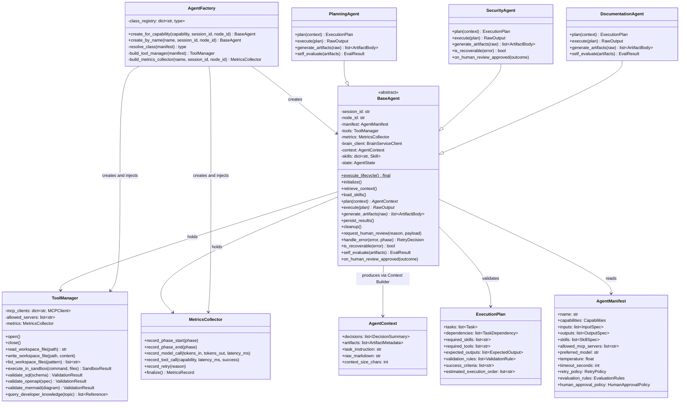
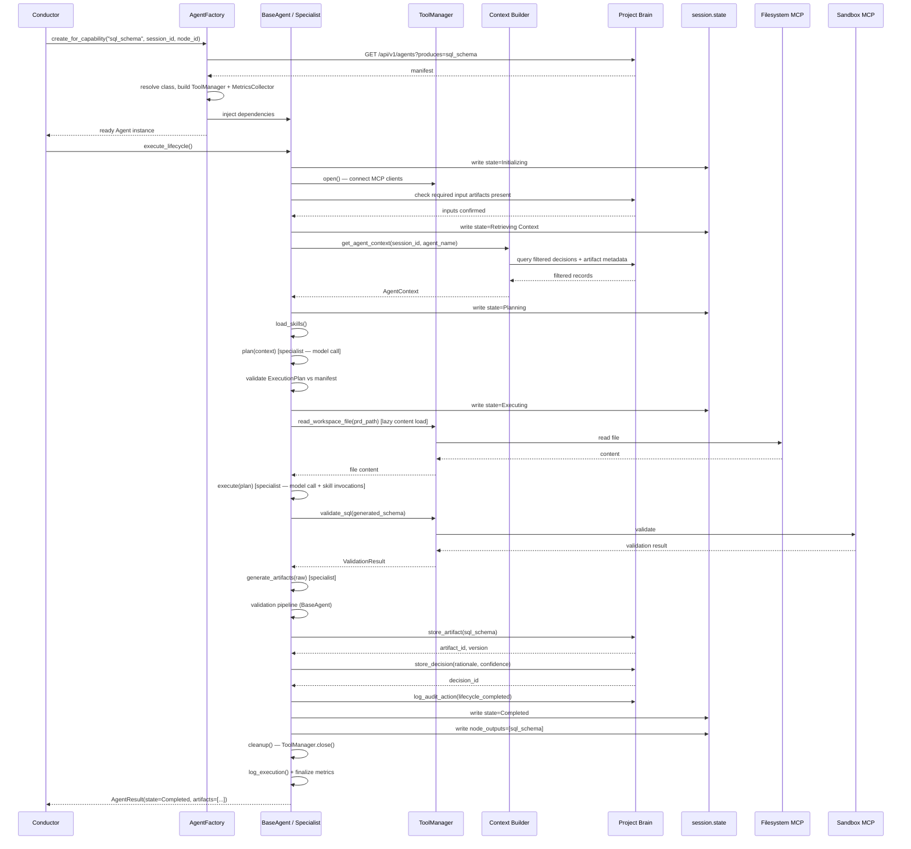
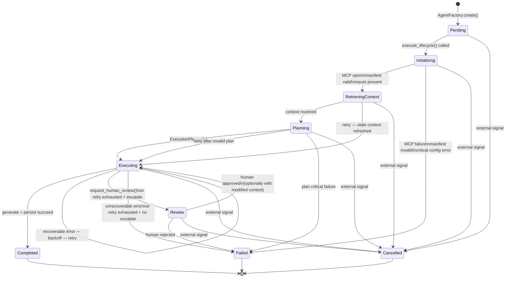

# BASE_AGENT.md

**Orchestra AI — BaseAgent Implementation Specification**

| Field | Value |
|---|---|
| Document path | `docs/design/BASE_AGENT.md` |
| Status | **Final — Ready for Implementation** |
| Version | 1.0.0 |
| Depends on | `AGENT_FRAMEWORK.md` v1.0.0 |
| Audience | Antigravity Engineering Team |

---

## Table of Contents

1. [Purpose](#1-purpose)
2. [Responsibilities](#2-responsibilities)
3. [Design Principles](#3-design-principles)
4. [Lifecycle](#4-lifecycle)
5. [Integration with Google ADK](#5-integration-with-google-adk)
6. [Integration with Project Brain](#6-integration-with-project-brain)
7. [ToolManager Integration](#7-toolmanager-integration)
8. [Context Builder Integration](#8-context-builder-integration)
9. [State Machine](#9-state-machine)
10. [Error Handling](#10-error-handling)
11. [Logging & Observability](#11-logging--observability)
12. [Extension Points](#12-extension-points)
13. [Mermaid Diagrams](#13-mermaid-diagrams)
14. [Implementation Checklist](#14-implementation-checklist)

---

## 1. Purpose

### Why BaseAgent Exists

Orchestra AI coordinates eight or more specialist agents — Planning, Blueprint, Security Review, Database Design, API Design, DevOps, Documentation, and others yet to be added. Each specialist performs exactly one engineering responsibility and produces exactly one category of output. In a system this structured, the risk is not insufficient specialization; it is inconsistency across implementations.

Without a shared foundation, each specialist would independently invent its own approach to retry logic, context retrieval, artifact persistence, error handling, logging, and ADK integration. These divergences compound silently: a retry that works in the Planning Agent behaves differently in the Security Agent; a log record from the DevOps Agent has different fields from one produced by the Documentation Agent; a Project Brain write succeeds in one agent but is batched differently in another. Debugging, monitoring, and extending the system become progressively harder with each specialist added.

`BaseAgent` eliminates this class of problem. It is an abstract class that encodes every mechanical, infrastructure-level behavior shared across all specialists. It owns the execution sequence, state machine, error handling strategy, Brain interaction, tool access mediation, logging format, and metrics capture — exactly once — so that every specialist inherits correct, consistent, and tested behavior without re-implementing it.

### Why Every Specialist Inherits from BaseAgent

Inheritance is the right relationship here precisely because the shared behavior is not optional. Every specialist agent in Orchestra AI must follow the same lifecycle, emit the same log structure, write to Project Brain the same way, and handle errors through the same classification system. These are not behaviors a specialist should be able to skip or replace. The Template Method pattern (Section 4) enforces this by fixing the execution sequence in a `final` method that subclasses cannot override — specialists contribute domain logic at designated extension points, nothing else.

A specialist that inherits from `BaseAgent` gains:

- A complete, tested execution lifecycle with no boilerplate to write.
- Correct Project Brain integration with no Brain client code to manage.
- Retry and escalation behavior configured entirely through its `agent.yaml` manifest.
- Structured logging and metrics emission on every phase automatically.
- MCP tool access through `ToolManager` without managing any client connections.
- ADK `session.state` integration without knowing ADK internals.

The specialist contributes:

- A system prompt.
- A `plan()` implementation: what to produce, given context.
- An `execute()` implementation: how to produce it, using `self.tools` and `self.skills`.
- A `generate_artifacts()` implementation: how to transform raw output into artifact bodies.
- Optionally: a domain-specific `is_recoverable()` classifier and `self_evaluate()` check.

That is the entire surface area of a specialist. Everything else is the framework's problem.

---

## 2. Responsibilities

The single most important engineering decision in the BaseAgent design is the **mechanism/policy boundary**. The framework owns mechanisms — how things happen. Specialists own policy — what happens and when. This boundary must be clear, consistent, and structurally enforced.

### Framework Responsibilities (BaseAgent owns these — specialists do not touch them)

| Responsibility | Description |
|---|---|
| **Lifecycle sequencing** | The eight-phase execution sequence runs in a fixed order via the Template Method. Specialists cannot reorder, skip, or add phases. |
| **State machine management** | State transitions are computed and executed by BaseAgent. Specialists may trigger a transition (by returning a recoverable error or calling `request_human_review()`) but never execute one directly. |
| **ADK session.state synchronization** | BaseAgent reads and writes `session.state` to keep the Conductor informed of agent status. Specialists have no direct ADK state access. |
| **Context retrieval mechanics** | BaseAgent calls the Context Builder and returns a typed `AgentContext` to the specialist. Specialists never query Project Brain directly. |
| **MCP client lifecycle** | Opening, authenticating, and closing MCP client connections is owned by `ToolManager`, which is constructed and held by BaseAgent. Specialists never instantiate MCP clients. |
| **Project Brain write path** | `persist_results()` batches all writes — artifacts, decisions, audit records — to Project Brain. Specialists return structured data; they never call Brain APIs directly. |
| **Artifact schema normalization** | BaseAgent computes SHA-256 checksums, resolves `depends_on` from consumed context artifacts, sets `generated_by` from the manifest, and registers artifact versions. Specialists return content bodies only. |
| **Retry execution** | BaseAgent applies the backoff policy from the manifest. Specialists declare what is recoverable; BaseAgent decides when and how to retry. |
| **Human review mechanics** | `request_human_review()` is a BaseAgent method. It pauses the agent, updates ADK `session.state`, and surfaces the payload to the Human Approval Console. Specialists call it; they don't implement it. |
| **Structured logging** | Every lifecycle phase emits a structured log record automatically. Specialists add domain annotations via a provided logging context object, but do not format or emit records themselves. |
| **Metrics capture** | Token usage, latency, context size, cost estimation, and retry counts are captured automatically by `MetricsCollector`. Specialists never write metrics directly. |
| **`ExecutionPlan` validation** | After `plan()` returns, BaseAgent validates the plan against the manifest (declared skills, declared tools, allowed MCP servers) before allowing `execute()` to run. |
| **Cleanup** | `cleanup()` always runs in a `finally` block, unconditionally, including on failure and cancellation paths. |

### Specialist Responsibilities (Subclasses own these — BaseAgent does not touch them)

| Responsibility | Description |
|---|---|
| **System prompt** | The complete instruction set for the agent's domain role. |
| **`plan()` implementation** | Given a structured `AgentContext`, decide what this execution will produce and how. Returns an `ExecutionPlan`. |
| **`execute()` implementation** | Carry out the `ExecutionPlan` using `self.tools.<capability>()` and loaded skills. Returns `RawOutput`. |
| **`generate_artifacts()` implementation** | Transform `RawOutput` into one or more artifact content bodies. |
| **`is_recoverable(error)` override** | Domain-specific classification of whether a given error is worth retrying. The default implementation in BaseAgent covers common transient errors; specialists refine it for domain-specific failure modes. |
| **`self_evaluate(artifacts)` override** | Optional lightweight sanity check on generated artifacts before they are committed. |
| **`on_human_review_approved(outcome)` override** | Optional hook to react when a human approves a review, potentially incorporating reviewer annotations into the next execution. |
| **Decision rationale** | The content of design decisions — rationale text, confidence score, alternatives considered — is specialist-authored and returned as part of `RawOutput`. The BaseAgent handles the write. |

### What Belongs Nowhere But Here

Two anti-patterns to prevent during implementation:

1. **A specialist that queries Project Brain directly.** This breaks the single writer guarantee and makes Brain interaction untestable and inconsistent. If a specialist needs data that isn't in its `AgentContext`, the fix is to update the manifest's `inputs` declaration so the Context Builder includes it — not to add a direct Brain query in the specialist.

2. **A specialist that calls `self.mcp["sandbox"].call_tool(...)`.** `BaseAgent` should not expose a `self.mcp` attribute. `self.tools` is the only tool access surface. A lint check should enforce this.

---

## 3. Design Principles

### Single Responsibility Principle

`BaseAgent` has one responsibility: provide the reusable execution framework that all specialists inherit. It does not know what SQL schemas look like, what security vulnerabilities are, or what a PRD should contain. When `BaseAgent` is modified, the reason should always be "we need to change how agents execute" — never "we need to change what an agent produces."

Each specialist likewise has one responsibility: produce one category of engineering artifact from the provided context. When a `DatabaseDesignAgent` is modified, the reason should always be "we need to improve how database schemas are generated" — never "we need to change how retries work."

This division means that a change to retry logic affects one file (`BaseAgent`), not eight specialist files. A change to SQL schema generation affects one file (`DatabaseDesignAgent`), not `BaseAgent` or any other specialist.

### Open/Closed Principle

`BaseAgent` is **open for extension** through its declared override points (`plan`, `execute`, `generate_artifacts`, `is_recoverable`, `self_evaluate`, `on_human_review_approved`) and **closed for modification** from the specialist layer. A specialist that needs new behavior adds it through one of these extension points. If a genuinely new cross-cutting concern arises (a ninth lifecycle phase, a new logging field), it is added to `BaseAgent` once, and all specialists benefit immediately.

The `execute_lifecycle()` method is explicitly `final`. This is the most important application of the Open/Closed principle in the framework: the lifecycle sequence is closed to modification from any direction. Specialists extend what happens *within* phases, not the phases themselves.

### Dependency Injection

`BaseAgent` receives its dependencies — `ToolManager`, `MetricsCollector`, `BrainServiceClient`, `AgentManifest` — through constructor injection, provided by `AgentFactory`. It does not construct these itself. This has three consequences:

- Every dependency is independently mockable in tests. A unit test for any specialist can pass a mock `ToolManager` returning fixture data without any real MCP server.
- `BaseAgent` does not contain import-time coupling to specific MCP servers, Brain implementations, or metric backends.
- Changing the `ToolManager` implementation (e.g., adding a new MCP server) requires no changes to `BaseAgent` or any specialist.

### Composition over Inheritance (Where Appropriate)

The relationship between `BaseAgent` and the infrastructure components it uses (`ToolManager`, `MetricsCollector`, `SkillLoader`, `ContextBuilder`) is **composition**, not inheritance. `BaseAgent` holds these as injected collaborators, not as base classes. This keeps `BaseAgent`'s inheritance hierarchy shallow and purpose-specific.

The relationship between `BaseAgent` and specialist agents is **inheritance**, which is appropriate here because specialists share not just interface but behavior — they don't just agree to *have* a lifecycle, they share the *same* lifecycle implementation. Composition would be the wrong choice for this relationship, as it would force every specialist to re-delegate to the same lifecycle implementation.

### Separation of Concerns

The framework enforces four distinct concerns across four distinct boundaries:

| Concern | Owner |
|---|---|
| Orchestration and DAG management | Conductor (ADK) |
| Execution mechanics (lifecycle, state, errors, logging) | BaseAgent |
| Domain logic (planning, generation, evaluation) | Specialist Agent |
| Persistent engineering memory | Project Brain |

`BaseAgent` sits precisely at the boundary between orchestration and domain logic. It receives work from the Conductor and delegates domain execution to the specialist. It writes results to Project Brain. It does not reach into the Conductor's DAG logic, and it does not contain domain knowledge.

---

## 4. Lifecycle

The execution lifecycle is a fixed eight-phase sequence owned by `execute_lifecycle()`. This method is the Template Method — it calls each phase in order and handles the routing of results, errors, and state transitions between them. Specialists override designated hooks within phases; they never override `execute_lifecycle()` itself.

Every phase is wrapped with timing instrumentation. Every phase transition updates the state machine. Errors in any phase are routed through `handle_error()`, which applies classification and retry/escalation logic before deciding the next state.

```
execute_lifecycle()
│
├── Phase 1: initialize()
├── Phase 2: retrieve_context()
├── Phase 3: load_skills()
├── Phase 4: plan()                ◄── specialist override
├── Phase 5: execute()             ◄── specialist override
├── Phase 6: generate_artifacts()  ◄── specialist override
├── Phase 7: persist_results()
├── Phase 8: cleanup()             ─── always runs (finally)
│
└── log_execution()                ─── always runs (finally), after cleanup
```

---

### Phase 1: `initialize(session_id, node_id)`

**Owner:** BaseAgent (no specialist override)

**What happens:**

The agent binds to a specific unit of work identified by `session_id` and `node_id`. `AgentFactory` has already constructed and injected the `ToolManager`, `MetricsCollector`, and `BrainServiceClient` before this is called, so `initialize()` is not responsible for constructing these — it is responsible for *activating* them.

Specifically, `initialize()` does the following in order:

1. Stores `session_id` and `node_id` as instance fields.
2. Reads the agent's `AgentManifest` from the injected reference (already resolved by `AgentFactory`).
3. Calls `ToolManager.open()` to open MCP client connections for the servers declared in `manifest.allowed_mcp_servers`. If any connection fails, this is a **critical failure** — it indicates a configuration problem, not a transient error, and transitions directly to `Failed` without retrying.
4. Validates that every artifact type declared as `required: true` in `manifest.inputs` exists in the current session (via a lightweight Brain status check). If a required input is absent, this is a **recoverable failure** that routes to `Retrying` with backoff — the upstream artifact may simply not have been committed yet.
5. Transitions the state machine to `Initializing`.
6. Records the initialization start timestamp in `MetricsCollector`.

**What this phase must not do:**
- Fetch artifact content (that is Phase 2).
- Load skills (that is Phase 3).
- Make any model calls.

**Failure behavior:**
- MCP connection failure → `Failed` (critical, non-retryable)
- Missing required input artifact → `Retrying` (recoverable, upstream dependency not yet ready)
- Manifest not found or invalid → `Failed` (critical, configuration error)

---

### Phase 2: `retrieve_context()`

**Owner:** BaseAgent (no specialist override)

**What happens:**

BaseAgent calls the Context Builder with `(session_id, agent_name)` and receives a structured `AgentContext` object. This object contains:

- `decisions`: a list of relevant decision summaries from prior nodes in this session, filtered to topics the manifest declares as inputs.
- `artifacts`: metadata records (path, type, checksum, version, description) for all relevant artifacts in this session. **Full artifact content is not included here** — only metadata. Full content is fetched lazily in Phase 5 via `ToolManager.read_workspace_file()`.
- `task_instruction`: the specific instruction for this node's execution, sourced from the DAG node configuration in `session.state`.
- `raw_markdown`: the complete Context Builder output as a formatted markdown block, suitable for direct injection into a model prompt.
- `context_size_chars`: the character count of `raw_markdown`, recorded into `MetricsCollector` immediately.

**Context is retrieved once per execution.** On retry, the same `AgentContext` is reused unless the failure is specifically a stale-context failure (rare: this would only occur if an upstream agent committed a new artifact after this agent's context was retrieved, and this agent's plan explicitly depends on that artifact). Stale-context retries re-invoke `retrieve_context()`.

Transitions the state machine to `Retrieving Context`.

**Failure behavior:**
- Empty context when required inputs are declared → `Retrying` (upstream may not be committed)
- Context Builder service unavailable → `Retrying` (transient infrastructure failure)

---

### Phase 3: `load_skills()`

**Owner:** BaseAgent (no specialist override, but reads manifest declarations)

**What happens:**

`SkillLoader` resolves each skill name declared in `manifest.skills` to a loaded `Skill` object. Skills are lazy in the sense that they are resolved here (confirmed to exist and be importable at the required version) but not invoked — invocation happens in Phase 5 when the specialist's `execute()` calls them.

The result is a keyed map stored as `self.skills`: `{"schema_normalization": <Skill>, "index_recommendation": <Skill>}`. This map is available to the specialist's `execute()` and `generate_artifacts()` implementations.

A skill declared in the manifest that is not installed at the required version is a **critical failure** — this indicates a deployment configuration problem that cannot be resolved by retrying. It transitions to `Failed`.

**Failure behavior:**
- Missing or incompatible skill version → `Failed` (critical, configuration error)

---

### Phase 4: `plan(context: AgentContext) → ExecutionPlan`

**Owner:** Specialist override (required)

**What BaseAgent does around it:**

Before calling `plan()`, BaseAgent records the invocation timestamp. After `plan()` returns, BaseAgent validates the returned `ExecutionPlan` against the manifest:

- Every skill in `ExecutionPlan.required_skills` must appear in `manifest.skills`. If not, the plan is rejected before `execute()` runs.
- Every tool capability in `ExecutionPlan.required_tools` must be backed by a server in `manifest.allowed_mcp_servers`. If not, the plan is rejected.
- `ExecutionPlan.expected_outputs` must be non-empty (a plan that declares it will produce nothing is malformed).
- BaseAgent computes `ExecutionPlan.estimated_execution_order` via topological sort of the `dependencies` edges — specialists return tasks and dependency edges, BaseAgent derives the execution order.

If plan validation fails, BaseAgent routes to `Retrying` (recoverable — the model may have produced a subtly invalid plan that can be corrected on the next attempt) or, after retry exhaustion, to `WaitingForHumanApproval` or `Failed` per the manifest's `retry_policy`.

Transitions the state machine to `Planning`.

**What the specialist implements:**

A single Gemini/ADK model call using the agent's system prompt plus `context.raw_markdown` plus the `task_instruction`. The output is a populated `ExecutionPlan` object. The specialist should not perform any tool calls in this phase — planning is a reasoning step only.

The `ExecutionPlan` fields the specialist populates:
- `tasks`: what this execution will do, broken into steps.
- `dependencies`: ordering constraints between tasks.
- `required_skills`: which loaded skills this plan will invoke.
- `required_tools`: which ToolManager capabilities this plan will invoke.
- `expected_outputs`: what artifact types this execution intends to produce.
- `validation_rules`: artifact-specific checks to apply in Phase 6.
- `success_criteria`: human-readable completion conditions for escalation context.

---

### Phase 5: `execute(plan: ExecutionPlan) → RawOutput`

**Owner:** Specialist override (required)

**What BaseAgent does around it:**

Wraps this phase in a timeout enforcer (`manifest.timeout_seconds`). A timeout is treated as a recoverable failure on the first occurrence. BaseAgent also wraps any exception raised from this phase through `handle_error()` before propagating.

Transitions the state machine to `Executing`.

**What the specialist implements:**

Carries out the `ExecutionPlan` in the order specified by `estimated_execution_order`. The specialist has access to:

- `self.tools.<capability>(...)` for all external operations (file reads, sandbox execution, knowledge queries).
- `self.skills["skill_name"].run(...)` for loaded skills.
- `self.context` (the `AgentContext` from Phase 2) for referencing metadata about available artifacts.

The specialist **must not** construct MCP clients, call Brain APIs, or access `session.state` directly. All external access goes through `self.tools`; all persistent read access goes through the already-retrieved `self.context`.

`RawOutput` is an unvalidated, unnormalized container for everything the specialist produced: generated text blocks, file contents, design decisions with rationale, confidence scores, and any flags (e.g., "requires human review because..."). Its exact structure varies by specialist; BaseAgent treats it as an opaque container until Phase 6.

---

### Phase 6: `generate_artifacts(raw: RawOutput) → list[ArtifactBody]`

**Owner:** Specialist override (required)

**What BaseAgent does around it:**

After the specialist returns a list of `ArtifactBody` objects (each containing a content string and a declared `artifact_type`), BaseAgent normalizes each into a complete `Artifact` record:

- Computes SHA-256 checksum of the content.
- Sets `generated_by` from the manifest name.
- Resolves `depends_on` by cross-referencing the artifact metadata in `self.context.artifacts` against the artifact types the plan declared as inputs.
- Assigns `session_id`, `file_path` (from the artifact's declared path convention), and `type`.
- Does not write to Brain yet — that is Phase 7.

BaseAgent then runs the deterministic **Validation Pipeline** against each normalized artifact:

- **Schema validation** (Pydantic): the `Artifact` record structure is correct.
- **Type-specific validation** via `ToolManager`:
  - SQL files: `self.tools.validate_sql(content)`
  - OpenAPI specs: `self.tools.validate_openapi(content)`
  - Mermaid diagrams: `self.tools.validate_mermaid(content)`
  - Markdown: structural completeness checks (non-empty, expected section headers present per manifest `evaluation_rules`).
- **Manifest evaluation rules** from `manifest.evaluation_rules.self_check`: deterministic rule assertions the specialist declared.

If validation fails, BaseAgent routes to `Retrying`. The specialist's optional `self_evaluate()` hook is called here as an additional check after the deterministic pipeline passes.

Transitions the state machine to `Generating Artifacts`.

**What the specialist implements:**

Transforms `RawOutput` into one or more `ArtifactBody` objects. Each `ArtifactBody` contains:
- `content`: the full text content of the artifact.
- `artifact_type`: the type string (e.g., `sql_schema`, `prd`, `openapi_spec`).
- `file_path`: the intended workspace path relative to the session directory.
- `decisions`: a list of `DecisionRecord` objects (title, rationale, alternatives, confidence_score) that arose during this execution and should be persisted.

---

### Phase 7: `persist_results()`

**Owner:** BaseAgent (no specialist override)

**What happens:**

BaseAgent writes the fully-normalized and validated artifacts to Project Brain in a logical batch:

1. For each artifact: `BrainServiceClient.store_artifact(...)`. Version auto-increment is handled server-side.
2. For each decision record returned in the `ArtifactBody` list: `BrainServiceClient.store_decision(...)`. A decision record with an empty `rationale` field is **rejected before writing** — decisions must be documented.
3. An audit record: `BrainServiceClient.log_audit_action(agent, action="lifecycle_completed", details={...})`.

**A Brain write failure after successful generation is a `Failed` state, not a `Completed` state.** An artifact that exists on the filesystem but is not recorded in Project Brain is worse than an artifact that doesn't exist at all — it breaks the audit trail, the dependency graph, and the Conductor's view of session state.

After writes succeed, BaseAgent updates `session.state` via the Conductor's update path to reflect that this node has produced its declared outputs.

Transitions the state machine to `Completed` on full success.

---

### Phase 8: `cleanup()`

**Owner:** BaseAgent (no specialist override)

**What happens:**

Runs unconditionally in a `finally` block — this is non-negotiable. `cleanup()` releases all held resources:

- Calls `ToolManager.close()` to close all MCP client connections and release sandbox sessions.
- Clears any temporary files written to the workspace that were not committed as artifacts.
- Finalizes the `MetricsCollector` record for this execution.
- Emits the structured execution log record (Phase 8 and log emission are bundled in the `finally` block to guarantee both run).

`cleanup()` must not raise exceptions itself — any errors during cleanup are logged at warning severity but do not change the terminal state already set (e.g., a cleanup error after a `Failed` execution should not obscure the original failure).

---

## 5. Integration with Google ADK

### Relationship with ADK Agents

`BaseAgent` is not itself a Google ADK agent class. It is an Orchestra AI abstraction that specialist agents inherit from, designed to run *inside* the ADK orchestration model. The Conductor is an ADK Root Agent; it dispatches work to specialist agents using ADK's native `SequentialAgent`, `ParallelAgent`, and `LoopAgent` primitives. `BaseAgent` exposes an execution interface compatible with ADK's tool-call and sub-agent invocation conventions.

Concretely: when ADK dispatches a node to a specialist, it invokes the specialist's execution entry point with an ADK context object. `BaseAgent.execute_lifecycle()` is that entry point. It receives the ADK context, extracts `session_id` and `node_id`, and owns the execution from that point forward.

### `session.state` Usage

ADK's `session.state` is the runtime coordination layer between the Conductor and all running agents. `BaseAgent` interacts with it at defined points:

| When | What BaseAgent reads or writes |
|---|---|
| `initialize()` | Reads `session.state["node_{node_id}_task_instruction"]` to get the specific task this execution should perform. |
| Every state transition | Writes `session.state["node_{node_id}_status"]` with the current state machine value. |
| `retrieve_context()` | Reads `session.state["session_id"]` and `session.state["project_id"]` for Brain queries. |
| `execute()` on retry | Writes `session.state["node_{node_id}_retry_count"]`. |
| `request_human_review()` | Writes `session.state["pending_approval"]` with a structured payload the Conductor routes to the Human Approval Console. |
| `persist_results()` | Writes `session.state["node_{node_id}_outputs"]` with the list of artifact types produced, so the Conductor's DAG executor can mark dependencies as satisfied for downstream nodes. |

`BaseAgent` reads from and writes to `session.state` only through a thin `SessionStateAdapter` — it does not hold a direct ADK session reference in specialist-visible scope. This keeps the ADK coupling isolated to one place and keeps specialist code free of ADK internals.

### Orchestration Expectations

`BaseAgent` expects the Conductor to have done three things before dispatching a node:

1. **Dependency resolution**: all nodes listed in the manifest's `dependencies` field have reached `Completed` status in `session.state`. The Conductor's DAG executor is responsible for this; `BaseAgent` does not re-check it (checking at `initialize()` for required input *artifacts* in the Brain is a separate, complementary check).
2. **Task instruction**: `session.state["node_{node_id}_task_instruction"]` is populated with the specific directive for this execution.
3. **Capability confirmation**: the Conductor has confirmed via the Agent Registry that this agent advertises the capability required by this node. `BaseAgent` trusts this confirmation and does not re-query the registry.

### Lifecycle Ownership

The Conductor owns the DAG. `BaseAgent` owns the lifecycle of a single node execution within that DAG. These two ownership zones are distinct and non-overlapping. The Conductor does not step into lifecycle phases; `BaseAgent` does not step into DAG traversal logic. The only coordination interface is `session.state` and the terminal state signal (`Completed` / `Failed` / `Cancelled`) that `BaseAgent` writes when the lifecycle ends.

---

## 6. Integration with Project Brain

### The Fundamental Rule

**`BaseAgent` is the only component that writes to Project Brain on behalf of a specialist agent.** Specialists never call Brain APIs directly. This rule makes Brain interaction auditable, consistent, and testable from a single place.

### What BaseAgent Reads

| Data | When | Method |
|---|---|---|
| Agent manifest | `initialize()` (already injected by Factory; Brain is not queried again during execution) | Via injected `AgentManifest` |
| Required input artifact existence check | `initialize()` | Lightweight status-only query via `BrainServiceClient` |
| Filtered context block (decisions + artifact metadata) | `retrieve_context()` | Via Context Builder service which queries Brain internally |

**BaseAgent does not read full artifact content from the Brain directly.** Full content is fetched lazily during `execute()` via `ToolManager.read_workspace_file()` — the Filesystem MCP, not the Brain API, is the content delivery mechanism. The Brain stores metadata and versioning; the filesystem stores content.

### What BaseAgent Writes

| Data | When | Brain endpoint |
|---|---|---|
| Artifact records (metadata, checksum, version, path) | `persist_results()` | `store_artifact()` |
| Decision records (title, rationale, confidence, alternatives) | `persist_results()` | `store_decision()` |
| Audit action record | `persist_results()` | `log_audit_action()` |
| (Reads only — does not write) Evaluation records | Written by the Evaluation Agent, not by specialist agents | N/A |

### Batch Persistence Strategy

All writes in `persist_results()` occur as a logical unit. The implementation should:

1. Write all artifacts first. If any artifact write fails, abort the batch and transition to `Failed` — do not write partial decisions with no corresponding artifacts.
2. Write all decisions after all artifacts succeed. Decisions reference artifact paths; they should only be committed once the artifacts they describe are durably stored.
3. Write the audit record last, as a completion marker.

This ordering ensures that a partial failure (e.g., the service goes down between the second and third artifact write) leaves the Brain in a state where the successfully-written artifacts are visible, and the missing artifacts are detectable (the audit completion record is absent, signaling to operators that the batch was incomplete).

There is no distributed transaction available here (SQLite does not provide cross-request atomicity at the API layer). The batch ordering above minimizes the blast radius of a partial failure. Future work (PostgreSQL migration, Section 22 of `AGENT_FRAMEWORK.md`) may enable proper transactional batch writes.

---

## 7. ToolManager Integration

### The Abstraction Goal

Specialist agents need to perform external operations: read files from the shared workspace, execute generated code in an isolated environment, validate SQL schemas, and look up technical reference material. These operations are backed by three MCP servers. However, specialists must never know which MCP server backs which operation, and must never manage MCP client connections themselves.

`ToolManager` is the Facade that makes this possible. Specialists see only named capabilities. `ToolManager` resolves capabilities to MCP servers and tool calls internally.

### The Enforcement Mechanism

`BaseAgent` holds `ToolManager` as `self.tools`. It does **not** expose a `self.mcp` attribute or any direct MCP client reference. The injected `ToolManager` is constructed by `AgentFactory` scoped to `manifest.allowed_mcp_servers`. A capability whose backing server is not in this list raises immediately with a configuration error — there is no silent fallback.

Specialists access tool capabilities exclusively as: `self.tools.read_workspace_file(path)`, `self.tools.validate_sql(schema)`, `self.tools.execute_in_sandbox(command, files)`. This is the complete and only tool access interface.

### Capability-to-Server Mapping

| ToolManager Capability | Backing MCP Server | Notes |
|---|---|---|
| `read_workspace_file(path)` | Filesystem MCP | Returns file content as a string. |
| `write_workspace_file(path, content)` | Filesystem MCP | Provisional write; not committed to Brain until `persist_results()`. |
| `list_workspace_files(pattern)` | Filesystem MCP | Returns list of matching paths. |
| `execute_in_sandbox(command, files)` | Sandbox MCP | Isolated execution. Session scoped to this agent execution; closed in `cleanup()`. |
| `validate_sql(schema)` | Sandbox MCP | Returns structured validation result with error list. |
| `validate_openapi(spec)` | Sandbox MCP | Returns conformance check result. |
| `validate_mermaid(diagram)` | Sandbox MCP | Returns parse result. |
| `query_developer_knowledge(topic)` | Developer Knowledge MCP | Returns list of reference excerpts. Read-only; response cached within the execution. |

### Error Normalization

All MCP errors from any server are normalized by `ToolManager` into a uniform `ToolError` shape before they surface to `BaseAgent`:

```
ToolError {
  capability: string          // which capability was called
  server: string              // which MCP server backed it
  cause: string               // underlying error message
  recoverable_hint: boolean   // ToolManager's best guess at recoverability
}
```

`BaseAgent` passes `ToolError` to `is_recoverable()` for final classification. The `recoverable_hint` is advisory — the specialist's override may disagree.

### Why Specialists Must Never Invoke MCP Directly

- **Security**: direct MCP access bypasses the `allowed_mcp_servers` enforcement. An agent could reach a server not declared in its manifest.
- **Consistency**: per-specialist MCP client management creates eight different implementations of connection pooling, retry, and teardown.
- **Observability**: `ToolManager` automatically captures per-capability latency into `MetricsCollector`. Direct MCP calls would be invisible to the metrics system.
- **Maintainability**: if Sandbox MCP's `validate_sql` tool is renamed in a future version, one change in `ToolManager` updates all agents. With direct MCP calls, eight agents each need updating.

---

## 8. Context Builder Integration

### What the Context Builder Provides

The Context Builder is a service internal to Project Brain. Given `(session_id, agent_name)`, it queries the session's artifact and decision stores, filters to records matching the requesting agent's declared `inputs`, and returns a structured `AgentContext`.

`BaseAgent` consumes this service in `retrieve_context()`. The Context Builder's filtering logic is not the BaseAgent's concern — `BaseAgent` calls it and trusts its output.

### Progressive Context Loading

Context loading follows a deliberate two-tier strategy to manage token consumption:

**Tier 1 — Always loaded in `retrieve_context()`:**
- Decision summaries for relevant topics (title, rationale summary, confidence score, artifact references).
- Artifact metadata for relevant types (path, type, version, checksum, a brief description). Not full content.
- The `task_instruction` for this node.
- This tier is fast, small, and provides the structural understanding the specialist needs for `plan()`.

**Tier 2 — Loaded lazily during `execute()`:**
- Full content of specific artifact files, fetched via `self.tools.read_workspace_file(path)`.
- Only the files the `ExecutionPlan` actually needs are fetched — if a specialist's plan only needs the PRD content and not the system architecture document, only the PRD is fetched.
- This tier is on-demand and bounded by what the plan explicitly requests.

The two-tier approach prevents the context window from filling with the content of every prior artifact in the session. For a mature session with ten committed artifacts, loading all content in Tier 1 would be prohibitively expensive and largely irrelevant — the Database Design Agent does not need the full contents of the DevOps configuration to design a schema.

### Context Injection into Model Prompts

When the specialist assembles a model prompt in `plan()`, it should use:

```
[Agent System Prompt]
[context.raw_markdown]    ← structured context from Context Builder (Tier 1)
[task_instruction]
```

The `raw_markdown` field is the Context Builder's fully-formatted output, ready for injection without further transformation. Specialists should not re-query or re-format context — `raw_markdown` is the intended prompt injection surface.

### Token Efficiency

Three mechanisms keep context size manageable:

1. **Manifest-driven filtering**: the Context Builder only includes decisions and artifacts matching the agent's declared `inputs`. An agent that does not declare a dependency on `prd` artifacts will not receive PRD content in its context block.
2. **Metadata-only Tier 1**: artifact metadata is significantly smaller than artifact content. A PRD's metadata record might be 200 characters; its content might be 8,000.
3. **Single retrieval per execution**: context is retrieved once at Phase 2 and reused through all subsequent phases and retries. The `context_size_chars` metric (Section 11) provides visibility into context growth over time across sessions.

---

## 9. State Machine

The state machine governs the agent's execution at all times. Every state transition is recorded in `session.state` and emitted in the structured log. The Conductor observes state through `session.state`; it never queries the agent directly.

### States

| State | Meaning |
|---|---|
| `Pending` | The agent has been instantiated by `AgentFactory` but `execute_lifecycle()` has not yet been called. The Conductor has dispatched the node; the agent is queued. |
| `Initializing` | `initialize()` is running: manifest validated, MCP connections opening, input artifact presence checked. |
| `Retrieving Context` | `retrieve_context()` is running: Context Builder is being called. |
| `Planning` | `load_skills()` has completed; `plan()` is running; `ExecutionPlan` validation is in progress. |
| `Executing` | `execute()` and `generate_artifacts()` are running. This is the primary work phase. |
| `Review` | `request_human_review()` has been called. The agent is paused, waiting for a human decision via the Approval Console. The ADK `session.state["pending_approval"]` payload is populated. |
| `Completed` | `persist_results()` succeeded for all artifacts and decisions. The node's declared outputs are committed to Project Brain and reflected in `session.state`. |
| `Failed` | A critical or unrecoverable failure occurred. The failure is logged and audited. The Conductor observes this state and applies its DAG-level failure policy (fail-fast or continue-on-failure, depending on session configuration). |
| `Cancelled` | An external cancellation signal was received from the Conductor. `cleanup()` has run. |

### State Transitions

```
Pending ──────────────────────────────────────────► Initializing
                                                      (execute_lifecycle() called)

Initializing ─────────────────────────────────────► Retrieving Context
                                                      (manifest ok, MCP open, inputs present)

Initializing ─────────────────────────────────────► Failed
                                                      (configuration error / MCP critical failure)

Retrieving Context ───────────────────────────────► Planning
                                                      (context received, non-empty)

Retrieving Context ───────────────────────────────► Executing
                                                      (retry after stale context recovery)

Planning ─────────────────────────────────────────► Executing
                                                      (ExecutionPlan valid, skills loaded)

Planning ─────────────────────────────────────────► Executing
                                                      (retry — plan produced invalid plan, retrying)

Planning ─────────────────────────────────────────► Failed
                                                      (plan validation critical failure)

Executing ────────────────────────────────────────► Completed
                                                      (generate + persist both succeed)

Executing ────────────────────────────────────────► Executing
                                                      (retry after recoverable failure — backoff)

Executing ────────────────────────────────────────► Review
                                                      (request_human_review() called by specialist
                                                       or retry exhausted with escalate_on_exhaustion: true)

Executing ────────────────────────────────────────► Failed
                                                      (unrecoverable error or retries exhausted
                                                       with escalate_on_exhaustion: false)

Review ────────────────────────────────────────────► Executing
                                                      (human approved; may include modified context)

Review ────────────────────────────────────────────► Failed
                                                      (human rejected)

Any non-terminal state ───────────────────────────► Cancelled
                                                      (Conductor issues external cancellation)
                                                       cleanup() always runs
```

### Cancellation Handling

`Cancelled` is reachable from any non-terminal state. Cancellation signals arrive via the ADK execution context. When detected, `BaseAgent` transitions to `Cancelled`, stops the current phase at the nearest safe interrupt point, and runs `cleanup()`. The audit log records the cancellation reason sourced from `session.state`.

---

## 10. Error Handling

### Classification Model

Every error that surfaces in `execute_lifecycle()` is passed through `handle_error(error, phase)`, which classifies it and returns a routing decision.

**Tier 1 — Recoverable Failures**

Transient errors where re-executing the same plan is expected to succeed eventually.

Examples: Gemini API rate limit, Sandbox MCP timeout, Filesystem MCP transient unavailability, a model response that fails JSON parsing but is structurally close enough to repair on retry.

Handling: `handle_error()` returns `RetryDecision.RETRY`. BaseAgent applies exponential backoff using `manifest.retry_policy.base_delay_seconds`, increments the retry counter in `session.state`, and re-executes from the beginning of the failed phase (not from Phase 1 — context, skills, and the plan are retained across retries). After `manifest.retry_policy.max_retries` attempts:
- If `escalate_on_exhaustion: true`: routes to `Review`.
- If `escalate_on_exhaustion: false`: routes to `Failed`.

**Tier 2 — Critical Failures**

Failures where retrying the same plan cannot succeed.

Examples: manifest missing or invalid, MCP server not in `allowed_mcp_servers`, `ExecutionPlan` validation failure on an undeclared skill, Brain write failure after successful generation, skill installed below minimum required version.

Handling: `handle_error()` returns `RetryDecision.FAIL`. Transitions to `Failed` immediately. Logged at error severity. Audit record written.

**Tier 3 — Human Intervention**

Conditions that require human judgment rather than automated resolution.

Examples: retry exhaustion with `escalate_on_exhaustion: true`, specialist calls `request_human_review()` explicitly, `manifest.human_approval_policy.trigger_conditions` are met during artifact validation, a Security Review Agent finding above severity threshold.

Handling: `handle_error()` returns `RetryDecision.ESCALATE`. Transitions to `Review`. `session.state["pending_approval"]` is populated with the structured escalation payload (current state, reason, `ExecutionPlan`, relevant artifact metadata, `success_criteria`). The Conductor routes this to the Human Approval Console.

### `is_recoverable(error)` Classification

BaseAgent's default implementation classifies common infrastructure errors (HTTP 429, connection timeout, temporary service unavailability) as recoverable. Specialists override this to add domain-specific classification:

- A SQL validation failure (`validate_sql` returns errors) might be recoverable on the first attempt (the model may produce better SQL if given the error messages as feedback) but non-recoverable after two consecutive SQL validation failures (suggesting a fundamental planning issue).
- A missing PRD artifact might be recoverable if the Planning Agent is still running (dependency not yet committed) but non-recoverable if the Planning Agent has completed and the PRD is simply absent.

The override is additive: specialists can call `super().is_recoverable(error)` to invoke the base classification and refine the result.

### Retry State Preservation

Retries reuse the `AgentContext` from Phase 2 and the `ExecutionPlan` from Phase 4, unless the failure was a stale-context failure (rare). This is important: re-planning on every retry is undesirable because it may produce a different plan each time, making it impossible to determine whether the original plan was sound or whether the failure was environmental. The same plan re-executed is diagnostically cleaner.

When a human approves from the `Review` state and provides modified instructions, the agent **does** re-run Phase 2 and Phase 4 with the enriched context — this is the intended exception and is explicit.

### Timeout Strategy

| Phase | Timeout | Behavior on breach |
|---|---|---|
| `initialize()` | 30 seconds (hardcoded) | `Failed` (critical — if initialization takes this long, something is wrong with the environment) |
| `retrieve_context()` | 15 seconds (hardcoded) | `Retrying` (transient Brain service issue) |
| `load_skills()` | 10 seconds (hardcoded) | `Failed` (if skills can't load in 10 seconds, configuration is broken) |
| `plan()` | 60 seconds (hardcoded) | `Retrying` (model latency spike; acceptable to retry) |
| `execute()` | `manifest.timeout_seconds` | `Retrying` on first occurrence, then retry policy applies |
| `generate_artifacts()` | 30 seconds (hardcoded) | `Retrying` (artifact generation is post-model; should be fast) |
| `persist_results()` | 30 seconds (hardcoded) | `Failed` (Brain write failure; cannot mark Completed without it) |

---

## 11. Logging & Observability

### Two Output Streams

**Structured Log**: per-event, full fidelity, debugging-oriented. One record per significant event within a lifecycle execution. The primary tool for diagnosing a specific failed execution.

**Metrics Record**: per-execution aggregate, low-cardinality, dashboard-oriented. One record per completed `execute_lifecycle()` call. The primary input for monitoring dashboards, cost accounting, and performance optimization.

Both streams are emitted automatically by `BaseAgent` in the `finally` block of `execute_lifecycle()`. Specialists do not format or emit records.

### Structured Log Fields

| Field | Type | Description |
|---|---|---|
| `agent_name` | string | Manifest `name` field. |
| `session_id` | string | Session this execution belongs to. |
| `node_id` | string | DAG node this execution fulfills. |
| `timestamp` | ISO-8601 | Event timestamp. |
| `phase` | enum | Which lifecycle phase produced this event. |
| `state` | enum | State machine state at event time. |
| `duration_ms` | integer | Wall-clock time for this phase. |
| `input_hash` | SHA-256 | Hash of `context.raw_markdown + task_instruction`. Not the content itself — avoids duplicating potentially sensitive prompt content in logs. |
| `output_hash` | SHA-256 | Hash of all generated artifact content, concatenated. Matches artifact checksums in Brain. |
| `tool_calls` | list | One entry per `ToolManager` capability call: `{capability, server, duration_ms, success, error?}`. |
| `model_calls` | list | One entry per Gemini/ADK call: `{phase, duration_ms, prompt_tokens, completion_tokens}`. |
| `retries` | list | One entry per retry: `{attempt_number, reason, delay_ms, recoverable_classification}`. |
| `errors` | list | One entry per error: `{type, message, phase, tier}` where `tier` is Recoverable/Critical/HumanIntervention. |
| `state_transitions` | list | One entry per transition: `{from_state, to_state, reason, timestamp}`. |
| `evaluation_result` | object | `{rules_checked, passed, failed_rules}` from the validation pipeline and `self_evaluate()`. |
| `plan_summary` | object | `{task_count, required_skills, required_tools}` from the validated `ExecutionPlan`. |
| `terminal_state` | enum | `Completed`, `Failed`, or `Cancelled`. |

### Metrics Record Fields

| Metric | Unit | Notes |
|---|---|---|
| `token_usage_prompt` | tokens | Aggregated across all model calls in this execution. |
| `token_usage_completion` | tokens | Aggregated across all model calls. |
| `prompt_size_chars` | characters | Size of assembled prompt at each model call (list, one per call). |
| `context_size_chars` | characters | Size of `context.raw_markdown` from Phase 2. |
| `output_size_chars` | characters | Total size of all generated artifact content bodies. |
| `tool_latency_p50_ms` | ms | Median latency across all ToolManager calls. |
| `tool_latency_p99_ms` | ms | 99th percentile latency — identifies tail latency from flaky MCP servers. |
| `model_latency_total_ms` | ms | Total wall-clock time spent in model calls. |
| `total_execution_ms` | ms | Phase 1 start to Phase 8 end. |
| `retry_count` | integer | Total retries across all phases. |
| `estimated_cost_usd` | USD | `(prompt_tokens + completion_tokens) × model_pricing`. `model_pricing` sourced from a pricing lookup keyed on `manifest.preferred_model`. |
| `artifacts_produced` | integer | Count of artifacts successfully committed to Brain. |

### What These Metrics Enable

- **Cost accounting**: per-agent and per-session cost totals, enabling budget management for production use.
- **Context size trend**: if `context_size_chars` grows session-over-session as more artifacts are added, it signals that Context Builder filtering needs refinement.
- **Retry rate by agent**: a consistently high `retry_count` for one specialist signals either a flaky tool dependency or a prompt quality issue worth investigating.
- **Model latency outliers**: `model_latency_total_ms` identifies which agents are wall-clock bottlenecks in sequential sessions.
- **Token efficiency**: comparing `context_size_chars` to `token_usage_prompt` over time shows whether context loading is becoming inefficient.

---

## 12. Extension Points

The following describes exactly what each current and representative future specialist agent implements. All other behavior is inherited from `BaseAgent` unchanged.

### `PlanningAgent`

**`plan(context)`**: Uses a Gemini call to analyze the raw product idea from `task_instruction` and the session's initial context. Produces an `ExecutionPlan` with tasks for structuring the project scope, identifying major work streams, and generating the initial DAG recommendation.

**`execute(plan)`**: Calls `self.tools.query_developer_knowledge("project scoping best practices")` to ground the plan in reference material. Generates a structured project scope document and an ordered list of engineering work streams with effort classifications.

**`generate_artifacts(raw)`**: Returns a single `ArtifactBody` of type `prd` (Project Requirements Document) as the primary output, plus a `DecisionRecord` for each major scoping decision made (e.g., "Chose to include mobile API in scope because the product description explicitly mentioned mobile users").

**`is_recoverable(error)` override**: Not typically overridden — planning failures are usually model-related and benefit from the default classification.

**`self_evaluate(artifacts)` override**: Checks that the PRD contains the required structural sections (problem statement, scope, user stories, constraints).

---

### `BlueprintAgent`

**`plan(context)`**: Analyzes the PRD artifact from context and designs a system architecture plan. `ExecutionPlan` includes tasks for component identification, technology stack selection, data flow design, and diagram generation.

**`execute(plan)`**: May call `self.tools.validate_mermaid(diagram)` iteratively as it refines architecture diagrams. Uses `self.tools.query_developer_knowledge("microservices vs monolith trade-offs")` to ground technology decisions.

**`generate_artifacts(raw)`**: Returns artifacts of type `system_architecture` (narrative + Mermaid diagram) and `decision_log` (the technology choices made and their rationale).

**`self_evaluate(artifacts)` override**: Validates Mermaid diagrams via the validation pipeline (this is already handled automatically by BaseAgent — the Blueprint Agent's override may add additional checks specific to its architectural notation conventions).

---

### `SecurityAgent`

The Security Agent is a **reviewer** in the Generator-Critic pattern. Its extension point implementations reflect this:

**`plan(context)`**: Receives the artifact under review (identified in `task_instruction`) and designs a review plan covering OWASP Top 10 applicability, authentication/authorization patterns in the architecture, data exposure risks in the schema, and dependency security for the DevOps configuration.

**`execute(plan)`**: Evaluates each artifact against the review criteria. Does not call `execute_in_sandbox` — the Security Agent reasons about security characteristics, it does not execute the artifacts.

**`generate_artifacts(raw)`**: Returns an artifact of type `security_review` with structured findings (finding description, severity, affected artifact, remediation recommendation) and an overall `approve` / `reject` decision. A `reject` decision includes specific findings the originating agent must address.

**`is_recoverable(error)` override**: Security reviews are deterministic reasoning tasks — most failures here should escalate to human review rather than retry, especially if the model produces an incoherent review. Override to classify model output errors as `HumanIntervention` tier.

**`on_human_review_approved(outcome)` override**: If a human overrides a security rejection (approving despite a finding), the Security Agent logs the override as a decision record with the human's justification, creating an explicit exception record in the audit trail.

---

### `DocumentationAgent`

**`plan(context)`**: Reads artifact metadata for all produced engineering artifacts in the session and plans a documentation pass that covers each one: API reference from the OpenAPI spec, deployment guide from the DevOps configuration, database reference from the schema.

**`execute(plan)`**: Uses `self.tools.read_workspace_file()` heavily — this agent needs full artifact content (unlike most specialists that work from metadata). Generates documentation sections for each artifact.

**`generate_artifacts(raw)`**: Returns multiple `ArtifactBody` objects: one of type `api_documentation`, one of type `deployment_guide`, one of type `database_reference`. Each is a standalone markdown document.

**`self_evaluate(artifacts)` override**: Checks that every artifact type produced during the session appears at least once in the generated documentation.

---

### Adding a Future Agent (e.g., `CostEstimationAgent`)

1. Create `agent.yaml` with `capabilities.produces: ["cost_estimate"]`, `inputs: [{artifact_type: "system_architecture"}, {artifact_type: "sql_schema"}]`, `allowed_mcp_servers: ["developer_knowledge"]`.
2. Create class inheriting `BaseAgent`, implementing `plan()`, `execute()`, and `generate_artifacts()`. The `execute()` calls `self.tools.query_developer_knowledge("cloud pricing {technology}")` for reference data.
3. Register the manifest. Zero changes to any existing component.

---

## 13. Mermaid Diagrams

### Class Diagram



---

### Sequence Diagram — Full Lifecycle



---

### Lifecycle State Diagram



---

## 14. Implementation Checklist

This checklist is the implementation contract for Antigravity. Each item corresponds directly to a design decision in this document or in `AGENT_FRAMEWORK.md`. Items are ordered by dependency — complete earlier items before later ones.

### Phase A: Foundation

- [ ] **A1.** Define `AgentManifest` as a Pydantic model matching the full `agent.yaml` schema (Section 7 of `AGENT_FRAMEWORK.md`). Include all fields: `schema_version`, `version`, `name`, `description`, `mission`, `capabilities`, `inputs`, `outputs`, `dependencies`, `skills`, `allowed_mcp_servers`, `preferred_model`, `temperature`, `timeout_seconds`, `retry_policy`, `evaluation_rules`, `human_approval_policy`, `compatibility`.

- [ ] **A2.** Define `AgentContext` as a Pydantic model with fields: `decisions`, `artifacts` (metadata only), `task_instruction`, `raw_markdown`, `context_size_chars`.

- [ ] **A3.** Define `ExecutionPlan` as a Pydantic model with all fields from Section 4 (Phase 4): `tasks`, `dependencies`, `required_skills`, `required_tools`, `expected_outputs`, `validation_rules`, `success_criteria`. `estimated_execution_order` is computed by BaseAgent, not included in the specialist-returned object.

- [ ] **A4.** Define `RawOutput` as a flexible container type (typed dict or Pydantic model with `content_blocks`, `decision_records`, `flags`). Its structure must accommodate the different output shapes of all current specialist agents.

- [ ] **A5.** Define `ArtifactBody` as a Pydantic model with fields: `content`, `artifact_type`, `file_path`, `decisions: list[DecisionRecord]`.

- [ ] **A6.** Define `DecisionRecord` as a Pydantic model with fields: `title`, `rationale`, `alternatives_considered`, `confidence_score`. Validate that `rationale` is non-empty at model construction.

- [ ] **A7.** Define `AgentState` as an enum with all states from Section 9: `Pending`, `Initializing`, `RetrievingContext`, `Planning`, `Executing`, `Review`, `Completed`, `Failed`, `Cancelled`.

- [ ] **A8.** Define `RetryDecision` as an enum: `RETRY`, `FAIL`, `ESCALATE`.

- [ ] **A9.** Define `ToolError` as a Pydantic model with fields: `capability`, `server`, `cause`, `recoverable_hint`.

---

### Phase B: Supporting Components

- [ ] **B1.** Implement `MetricsCollector`. Must support: `record_phase_start(phase)`, `record_phase_end(phase)`, `record_model_call(tokens_in, tokens_out, latency_ms)`, `record_tool_call(capability, latency_ms, success)`, `record_retry(reason)`, `finalize() → MetricsRecord`. Tag every record with `agent_name`, `session_id`, `node_id`.

- [ ] **B2.** Implement `ToolManager`. Must: enforce `allowed_mcp_servers` at construction time; expose all capabilities listed in Section 7 (eight capability methods); normalize all MCP errors to `ToolError`; record per-call latency to injected `MetricsCollector`; expose `open()` and `close()` lifecycle methods. Must **not** expose raw MCP client references.

- [ ] **B3.** Verify that `BrainServiceClient` exposes the methods BaseAgent needs: `store_artifact()`, `store_decision()`, `log_audit_action()`, and the input-presence check used in `initialize()`. This client is expected to already exist as part of the Project Brain implementation — confirm the interface before using it.

- [ ] **B4.** Implement `SessionStateAdapter`. This is a thin wrapper around the ADK `session.state` dictionary, providing typed read/write methods for the keys BaseAgent uses (Section 5). Isolate all ADK `session.state` access here — `BaseAgent` should never access `session.state` directly.

- [ ] **B5.** Implement `SkillLoader`. Must: resolve skill names to loaded `Skill` objects; validate required versions; raise a configuration error (not a runtime error) if a declared skill is absent or incompatible.

- [ ] **B6.** Implement `AgentStateMachine`. Must: enforce valid transitions (reject invalid transitions with an exception); record every transition with a timestamp and reason; expose current state; write each transition to the `SessionStateAdapter`.

---

### Phase C: BaseAgent Core

- [ ] **C1.** Implement `BaseAgent` as an abstract class. Constructor signature must accept: `manifest: AgentManifest`, `tools: ToolManager`, `metrics: MetricsCollector`, `brain_client: BrainServiceClient`, `session_state: SessionStateAdapter`. No default construction of these — all injected.

- [ ] **C2.** Implement `execute_lifecycle()` as `final` (structurally non-overridable). Must call all eight phases in order. Must wrap all phases in per-phase timing. Must route exceptions from each phase through `handle_error()`. Must call `cleanup()` and `log_execution()` unconditionally in a `finally` block.

- [ ] **C3.** Implement `initialize(session_id, node_id)` per Section 4 (Phase 1). Must: open ToolManager, validate required inputs, transition state machine to `Initializing`, record start timestamp in MetricsCollector.

- [ ] **C4.** Implement `retrieve_context()` per Section 4 (Phase 2). Must: call Context Builder with `(session_id, agent_name)`; return typed `AgentContext`; store `context_size_chars` in MetricsCollector. Must not fetch full artifact content.

- [ ] **C5.** Implement `load_skills()` per Section 4 (Phase 3). Must use `SkillLoader`; populate `self.skills` dict; fail critically if declared skills are absent.

- [ ] **C6.** Declare `plan(context: AgentContext) → ExecutionPlan` as abstract. After specialist returns, BaseAgent must: compute `estimated_execution_order` via topological sort; validate `required_skills` against manifest; validate `required_tools` against `allowed_mcp_servers`; validate `expected_outputs` is non-empty.

- [ ] **C7.** Declare `execute(plan: ExecutionPlan) → RawOutput` as abstract. BaseAgent must wrap this with timeout enforcement from `manifest.timeout_seconds`.

- [ ] **C8.** Declare `generate_artifacts(raw: RawOutput) → list[ArtifactBody]` as abstract. After specialist returns, BaseAgent must: compute SHA-256 checksum per artifact; resolve `depends_on`; set `generated_by`; run the deterministic validation pipeline per Section 16 of `AGENT_FRAMEWORK.md` using ToolManager capabilities (`validate_sql`, `validate_openapi`, `validate_mermaid`); call `self_evaluate()` if overridden.

- [ ] **C9.** Implement `persist_results()` per Section 6. Must: write artifacts first, then decisions, then audit record; reject decisions with empty `rationale`; transition to `Completed` only if all writes succeed; treat Brain write failure as `Failed`.

- [ ] **C10.** Implement `cleanup()` per Section 4 (Phase 8). Must: call `ToolManager.close()`; clear unpersisted workspace writes; finalize `MetricsCollector`. Must not raise exceptions.

- [ ] **C11.** Implement `handle_error(error, phase) → RetryDecision`. Must: call `is_recoverable(error)` for tier classification; apply retry backoff if `RETRY`; increment retry counter in `SessionStateAdapter`; call `request_human_review()` if `ESCALATE`; transition to `Failed` if `FAIL`.

- [ ] **C12.** Implement default `is_recoverable(error) → bool`. Must classify common transient infrastructure errors as recoverable. Must be overridable by specialists.

- [ ] **C13.** Implement `request_human_review(reason, payload)`. Must: transition to `Review`; write structured escalation payload to `SessionStateAdapter["pending_approval"]`; block further lifecycle progression until resolution.

- [ ] **C14.** Implement `log_execution()`. Must: emit one structured log record per the schema in Section 11; record terminal state; include all phase durations, tool calls, model calls, retries, errors, state transitions, evaluation results.

- [ ] **C15.** Declare `self_evaluate(artifacts) → EvalResult` as optional override with a no-op default implementation. BaseAgent calls it after the deterministic validation pipeline in Phase 6.

- [ ] **C16.** Declare `on_human_review_approved(outcome)` as optional override with a no-op default implementation. BaseAgent calls it when transitioning from `Review` to `Executing` on approval.

---

### Phase D: Agent Factory

- [ ] **D1.** Implement `AgentFactory` with an internal `class_registry: dict[str, type]`. Classes are registered at process startup via a registration hook — not hardcoded per-name conditionals.

- [ ] **D2.** Implement `create_for_capability(capability, session_id, node_id) → BaseAgent`. Must: query Agent Registry for manifests advertising `capability`; apply disambiguation logic from Section 10 of `AGENT_FRAMEWORK.md` (input overlap filter, priority field, escalate if still tied); call `create(manifest, session_id, node_id)`.

- [ ] **D3.** Implement `create_by_name(name, session_id, node_id) → BaseAgent`. For use only when a specific agent is pinned (e.g., Security Review Agent in the Generator-Critic pattern).

- [ ] **D4.** Implement `create(manifest, session_id, node_id) → BaseAgent`. Must: resolve class from `class_registry`; construct `ToolManager` scoped to `manifest.allowed_mcp_servers`; construct `MetricsCollector` tagged with agent name, session ID, node ID; inject all dependencies into `BaseAgent` constructor; call `agent.initialize(session_id, node_id)`; return ready agent.

- [ ] **D5.** Validate `manifest.compatibility.min_framework_version` against the current framework version at Factory construction time. Reject incompatible manifests at startup, not at execution time.

---

### Phase E: Validation & Quality

- [ ] **E1.** Confirm the deterministic validation pipeline runs inside `generate_artifacts()` for all declared artifact types: SQL via `validate_sql`, OpenAPI via `validate_openapi`, Mermaid via `validate_mermaid`. Routing is based on `artifact_type`.

- [ ] **E2.** Write unit tests for `BaseAgent` using mock `ToolManager`, mock `BrainServiceClient`, and fixture `AgentContext` and `ExecutionPlan`. Cover: normal lifecycle completion, retry on recoverable error, escalation on retry exhaustion, critical failure routing, cleanup always runs, Brain write failure → `Failed` (not `Completed`).

- [ ] **E3.** Write unit tests for `ToolManager`: enforce `allowed_mcp_servers` boundary; confirm `ToolError` normalization; confirm per-call latency recording.

- [ ] **E4.** Write unit tests for `AgentStateMachine`: confirm valid transitions succeed; confirm invalid transitions raise; confirm transition log is populated.

- [ ] **E5.** Write unit tests for `AgentFactory`: confirm class registry lookup works; confirm `ToolManager` scoping is applied; confirm `MetricsCollector` tagging is correct.

- [ ] **E6.** Add a lint rule to CI that fails if any file in the `agents/` directory (specialist implementations) imports from the MCP client libraries directly or calls `BrainServiceClient` methods directly. The check should pass for `base_agent.py` and `tool_manager.py` and fail for any specialist module.

- [ ] **E7.** Confirm all eight phases in `execute_lifecycle()` are covered by at least one test that exercises the phase's success path and at least one test that exercises its failure path.

---

### Phase F: First Specialist Agent

- [ ] **F1.** Implement one specialist agent (recommended: `PlanningAgent`) end-to-end against the framework as a validation pass. The PlanningAgent should implement `plan()`, `execute()`, and `generate_artifacts()` only. All other behavior should come from `BaseAgent` without modification.

- [ ] **F2.** Run a full integration test: `AgentFactory.create_for_capability("prd", session_id, node_id)` → `execute_lifecycle()` against a test Project Brain instance and MCP stubs → confirm artifact is committed, decisions are stored, audit log is written, metrics record is finalized.

- [ ] **F3.** Verify the execution log record from the integration test contains all fields from Section 11. Verify the metrics record contains all fields from Section 11.

- [ ] **F4.** Confirm the PlanningAgent's manifest `agent.yaml` validates against the `AgentManifest` Pydantic model without errors.

---

*This document is ready for implementation. Questions about design decisions should reference `AGENT_FRAMEWORK.md` as the authoritative source. Proposed changes to any design decision in this document must be reviewed by the Architecture team before implementation begins.*