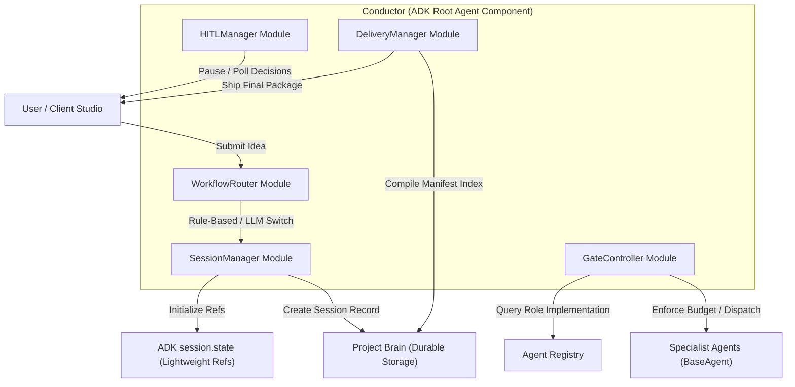
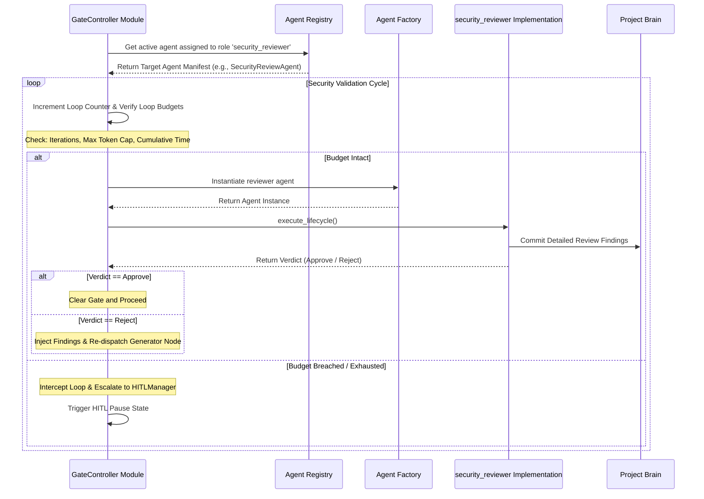

# CONDUCTOR_ARCHITECTURE.md

Status: FROZEN
Version: 1.0.1
Owner: Orchestra AI Architecture
Sprint: Sprint 2
Last Updated: July 2026

# CONDUCTOR_ARCHITECTURE.md

Orchestra AI — Conductor Architecture Specification

| Field | Value |
| --- | --- |
| **Document path** | `docs/architecture/CONDUCTOR_ARCHITECTURE.md` |
| **Status** | **FROZEN** |
| **Version** | **1.0.1** |
| **Sprint** | Sprint 2 — Implementation |
| **Depends on** | `AGENT_FRAMEWORK.md v1.0` · `BASE_AGENT.md v1.0` · `PROJECT_BRAIN.md v1.0` |
| **Audience** | Antigravity Engineering Team · Architecture Review Board |

---

## Table of Contents

1. Purpose & Scope
2. Design Principles
3. Responsibilities & Non-Responsibilities
4. High-Level Architecture
5. ADK Integration Model
6. Conductor Lifecycle
7. Workflow Routing System
8. Execution Patterns
9. State Management
10. Project Brain Integration
11. Role-Based Security Dispatch & Generator-Critic Gate
12. Evaluation Gate
13. Human-in-the-Loop (HITL)
14. Failure, Retry, Cancellation & Escalation Policies
15. Interfaces & Extension Points
16. Mermaid Diagrams
17. Design Rationale
18. Production Considerations
19. Future Enhancements

---

## 1. Purpose & Scope

### What the Conductor Is

The Conductor is the root orchestration agent of Orchestra AI. It is implemented as a Google ADK Root Agent and is the single entry point through which all work flows into the system and all results flow back to the user.

When a user submits a product idea — "Build a food delivery app for university students" — the Conductor receives that idea and is responsible for transforming it into a complete software engineering blueprint through coordinated delegation to specialist agents. It does not generate any engineering content itself. It plans, sequences, delegates, monitors, gates, and delivers.

The Conductor is a centralized orchestration component composed internally of dedicated helper modules rather than separate distributed services. Its role is to the specialist agents what a senior engineering manager is to a team of staff engineers: it defines the work, assigns it, enforces quality standards, handles escalations, and ensures the final output is coherent before it reaches the stakeholder.

### What This Document Covers

This document specifies the complete Conductor architecture: its internal helper modules, ADK integration model, lifecycle, workflow routing system, execution patterns, state management strategy, Project Brain interaction, the role-based security validation gate, the Evaluation Gate, the HITL system, all failure/retry/cancellation/escalation policies, interfaces, extension points, and design rationale.

This document does not specify:

* `BaseAgent` internals (see `BASE_AGENT.md`)
* Specialist agent domain logic
* Project Brain internals (see `PROJECT_BRAIN.md`)
* React Studio / Client Layer
* MCP server implementations

### Relationship to Frozen Documents

All design decisions in this document are consistent with and subordinate to:

* `AGENT_FRAMEWORK.md v1.0` — capability routing, AgentFactory, manifest-driven discovery, Event System
* `BASE_AGENT.md v1.0` — agent lifecycle, state machine, session.state contract, ToolManager
* `PROJECT_BRAIN.md v1.0` — Brain API surface, Context Builder, Agent Registry

No decision in this document requires modification to any frozen component.

---

## 2. Design Principles

### Orchestration Without Generation

The Conductor's most important constraint is what it must never do: generate engineering artifacts. It does not write PRDs, schemas, architecture documents, security reviews, or any engineering content. Its intelligence is entirely procedural — it knows how to sequence and gate work, not how to do the work itself. This constraint is structural, not aspirational. The Conductor's ADK agent definition contains no generative system prompt for engineering domains.

### ADK-Native, Not ADK-Adjacent

The Conductor uses ADK primitives (`SequentialAgent`, `ParallelAgent`, `LoopAgent`, routing, `session.state`) as the primary execution engine — not as a thin wrapper over a custom orchestration layer. Adding a custom DAG executor on top of ADK would mean maintaining two orchestration systems. ADK provides the sequencing, parallelism, looping, and state management primitives the Conductor needs; the Conductor's job is to compose them correctly, not to replace them.

### Single Communication Channel

Specialist agents never communicate with each other directly. All coordination passes through the Conductor via `session.state` and Project Brain. This rule keeps the interaction graph simple, auditable, and deterministic. The Conductor is the only component that can initiate inter-agent sequencing.

### Configuration Over Code

Workflow topology — which agents run, in what order, with what dependencies, with what approval requirements — is expressed as configuration (a `WorkflowDefinition`), not as hardcoded Conductor logic. The Conductor is a runtime over workflow definitions, not a hardcoded pipeline. Adding a new workflow type requires a new `WorkflowDefinition`, not a code change to the Conductor.

### Explicit Gates, Not Implicit Assumptions

Quality and security checks are explicit, mandatory gates in the workflow, not optional post-processing steps. The role-based security validation gate and the Evaluation Gate are positioned within the workflow topology itself. Skipping them is a deliberate configuration decision requiring justification, not the default.

### Fail Loudly, Recover Gracefully

The Conductor applies a fail-loud policy for configuration and structural errors (wrong manifest, missing capability, schema mismatch) and a recover-gracefully policy for transient operational failures (agent timeout, transient Brain write failure). A session that cannot start correctly should not start silently; a session that encounters a transient failure mid-execution should exhaust configured recovery options before surfacing to the operator.

---

## 3. Responsibilities & Non-Responsibilities

### Conductor Responsibilities

* **Session Initialization:** Create a session in Project Brain, populate initial lightweight `session.state`, validate the workflow definition, and confirm all required agent capabilities are available in the Agent Registry before the first agent is dispatched.
* **Workflow Topology Construction:** Translate the active `WorkflowDefinition` into an ADK agent graph (combinations of `SequentialAgent`, `ParallelAgent`, `LoopAgent`) appropriate for the requested work.
* **Capability-Based Agent Dispatch:** Resolve each workflow node to a specialist agent via `AgentFactory.create_for_capability()`. Never hardcode agent class names.
* **DAG Dependency Enforcement:** Ensure no agent is dispatched until all its declared input artifact types are present in Project Brain (`session.state` dependency tracking).
* **Session State Ownership:** Own the top-level lightweight `session.state` schema. Write node status, dependency satisfaction flags, retry counters, approval state, and session-level references.
* **Role-Based Security Routing:** After designated workflow nodes produce artifacts, route those artifacts to the agent assigned to the `security_reviewer` role for generator-critic review before marking the node's outputs as approved and allowing downstream nodes to proceed.
* **Evaluation Gate Enforcement:** Before delivering the final blueprint to the Client Studio, invoke the Evaluation Agent and enforce minimum quality thresholds.
* **HITL Coordination:** Detect pending approval entries in `session.state`, surface them to the Human Approval Console, receive human decisions, and route approvals or rejections back to the waiting agent or workflow branch.
* **Failure Classification and Routing:** Classify node-level failures as recoverable, retryable, or session-terminating. Apply the configured node retry policy. Escalate to HITL when policy requires.
* **Session Cancellation:** Propagate cancellation signals to all active nodes, wait for safe termination, and write a cancellation audit record.
* **Session Completion:** Compile the final artifact index from Project Brain, write a session completion record, and signal the Client Studio that the blueprint is ready for delivery.
* **Audit Trail Maintenance:** Write session-level audit events (session started, node dispatched, gate passed/failed, session completed/cancelled/failed) to Project Brain independent of node-level audit records.

### Conductor Non-Responsibilities

| Non-Responsibility | Owner |
| --- | --- |
| Generating engineering content (PRD, schema, spec, etc.) | Specialist agents |
| Determining the content of a security finding | Assigned `security_reviewer` agent implementation |
| Classifying whether a node error is recoverable | `BaseAgent` (`is_recoverable()`) |
| Fetching artifact content from the filesystem | `ToolManager` / Filesystem MCP |
| Computing artifact checksums or versions | `BaseAgent` / Project Brain |
| Constructing MCP client connections | `ToolManager` |
| Building or filtering agent context | Context Builder (Project Brain) |
| Determining which skills an agent needs | Agent manifest |
| Writing individual artifact or decision records | `BaseAgent` (`persist_results()`) |
| Evaluating artifact quality metrics | Evaluation Agent |

---

## 4. High-Level Architecture

The Conductor is a unified structural orchestration block. To ensure maintainability and high cohesion, it is internally partitioned into five focused Python helper implementation modules rather than isolated microservices.

### Internal Conductor Helper Modules

* **`WorkflowRouter`:** Processes incoming session configuration requests. Executes deterministic routing tables first, falling back to model-based classification only when matching rules are ambiguous.
* **`SessionManager`:** Manages runtime process bootstrapping, sets execution barriers, coordinates initialization sequences, and oversees graceful session teardown.
* **`GateController`:** Enforces pipeline validation boundaries, handles conditional branching for multi-stage processes, and wraps quality evaluation gates.
* **`HITLManager`:** Enforces human-in-the-loop coordination, transforms approval requests into structural pause/resume loops, and bridges state queries to the Client approval console.
* **`DeliveryManager`:** Aggregates finalized structural references, constructs verified artifact manifests, handles metadata formatting, and performs structural delivery completion handshakes.

```
┌──────────────────────────────────────────────────────────────────────────────┐
│  Client Studio (React)                                                        │
│  ┌───────────────┐  ┌──────────────────┐  ┌────────────────┐                │
│  │  Chat / Input │  │  Visual DAG      │  │ Artifact Viewer│                │
│  └──────┬────────┘  └──────────────────┘  └────────────────┘                │
│         │  product idea + session config                                      │
└─────────┼────────────────────────────────────────────────────────────────────┘
          │ REST / WebSocket
┌─────────▼────────────────────────────────────────────────────────────────────┐
│  Conductor  (ADK Root Agent Component)                                       │
│                                                                               │
│  ┌────────────────────────────────────────────────────────────────────────┐  │
│  │  Internal Helper Modules (Implementation Layout)                       │  │
│  │  ┌───────────────────┐ ┌───────────────────┐ ┌───────────────────┐     │  │
│  │  │  WorkflowRouter   │ │  SessionManager   │ │  GateController   │     │  │
│  │  └───────────────────┘ └───────────────────┘ └───────────────────┘     │  │
│  │  ┌───────────────────┐ ┌───────────────────┐                           │  │
│  │  │    HITLManager    │ │  DeliveryManager  │                           │  │
│  │  └───────────────────┘ └───────────────────┘                           │  │
│  └────────────────────────────────────────────────────────────────────────┘  │
│                                                                               │
│  ┌────────────────────────┐   ┌────────────────────────────────────────────┐ │
│  │  WorkflowDefinition    │   │  ADK Execution Graph                        │ │
│  │  (node graph + gates)  │   │  SequentialAgent                           │ │
│  └────────────────────────┘   │  ParallelAgent                             │ │
│                               │  LoopAgent                                  │ │
│                               └────────────────────────────────────────────┘ │
│                               ┌────────────────────────────────────────────┐ │
│                               │  session.state  (Lightweight ADK Runtime)  │ │
│                               │  artifact_ids · approval_request_id        │ │
│                               │  evaluation_id · workflow_state            │ │
│                               └────────────────────────────────────────────┘ │
│                                                                               │
│  ┌────────────────────────────────────────────────────────────────────────┐  │
│  │  AgentFactory  →  Capability Registry  →  Agent Manifests             │  │
│  └────────────────────────────────────────────────────────────────────────┘  │
└──────────────────────────────────────────────────────────────────────────────┘
          │                                        │
          │ dispatch by capability/role            │ Brain writes / reads
          ▼                                        ▼
┌───────────────────────────┐      ┌──────────────────────────────────────────┐
│  Specialist Agents        │      │  Project Brain (FastAPI + SQLite)         │
│  (BaseAgent subclasses)   │      │  Authoritative Long-Term Memory          │
│  Planning                 │      │  Artifact Bodies · Comprehensive Audits  │
│  Blueprint                │      │  Detailed Findings · Agent Registry      │
│  Database Design          │      └──────────────────────────────────────────┘
│  API Design               │
│  Reviewer Implementation  ◄────── Role-based dispatch for 'security_reviewer'
│  DevOps                   │
│  Documentation            │
└───────────────────────────┘

```

---

## 5. ADK Integration Model

### The Conductor as ADK Root Agent

The Conductor is registered as the root agent in the ADK application. It is the outermost agent that ADK's runner invokes when a new session begins. All sub-agents (specialist agents, validators, estimators) execute within the scope of a session that the Conductor owns.

### ADK Primitive Usage

The Conductor composes four ADK primitives to express workflow topology:

* `SequentialAgent` — Used when nodes must execute in strict order because later nodes depend on earlier nodes' outputs.
* `ParallelAgent` — Used when multiple nodes have all their dependencies satisfied and can execute concurrently, reducing total session wall-clock time.
* `LoopAgent` — Used to implement retry loops at the workflow level (distinct from `BaseAgent`'s per-node retry).
* `Routing` — Used within the Conductor's root agent to select between workflow branches at runtime.

### Optimized Runtime State Model

To ensure maximum processing efficiency, memory durability, and optimal performance under heavy parallel execution, Orchestra AI enforces a strict partition between runtime coordination data and durable data payloads.

**ADK `session.state` stores only lightweight runtime references.** High-volume text contents, massive code snippets, system logs, complete artifact output text blocks, and step-by-step audit metadata are strictly forbidden within `session.state` and remain safely stored within the transactional Project Brain.

### Allocated `session.state` Structural Schema

* `session.id` (String UUID)
* `session.project_id` (String UUID)
* `session.workflow_state` (Enum configuration token)
* `workflow.definition_id` (String key)
* `workflow.active_nodes` (List of String IDs)
* `workflow.completed_nodes` (List of String IDs)
* `node.{node_id}.status` (Enum lifecycle token)
* `node.{node_id}.artifact_ids` (List of target tracking UUID strings)
* `node.{node_id}.retry_count` (Integer tracking index)
* `gate.security.{node_id}.status` (Enum evaluation status token)
* `gate.security.{node_id}.loop_count` (Integer counting security rounds)
* `gate.security.{node_id}.evaluation_id` (Durable validation index reference)
* `approval.pending` (Boolean control flag)
* `approval.approval_request_id` (Durable target reference string)
* `approval.decision` (Enum processing token)

---

## 6. Conductor Lifecycle

The Conductor lifecycle spans the entire session execution across seven clear phases.

```
Session Request Received
         │
         ▼
Phase 1: Session Bootstrap (SessionManager initializes)
         │
         ▼
Phase 2: Workflow Selection & Validation (WorkflowRouter evaluates)
         │
         ▼
Phase 3: Pre-Flight Checks (SessionManager verifies)
         │
         ▼
Phase 4: Workflow Execution (ADK Graph executes + GateController validates)
    ├── Node Dispatch Loops
    ├── Role-Based Security Validation Gates
    └── Evaluation Gate Assembly
         │
         ▼
Phase 5: Final Evaluation & Quality Gate (GateController checks)
         │
         ▼
Phase 6: Blueprint Compilation & Delivery (DeliveryManager packages)
         │
         ▼
Phase 7: Session Close (SessionManager finalizes)

```

### Phase 1: Session Bootstrap

Coordinated by the `SessionManager`, this phase sets up process isolation barriers, initiates the backend storage tracking records via `BrainServiceClient.create_session()`, establishes lightweight data structural baselines in `session.state`, and issues a system-wide startup validation trace.

### Phase 2: Workflow Selection & Validation

The `WorkflowRouter` inspects incoming project characteristics to match the appropriate `WorkflowDefinition`. It validates the matched structure against current Agent Registry capability listings, ensuring every node has a satisfying provider before running down any process steps.

### Phase 3: Pre-Flight Checks

The `SessionManager` checks the availability of workspace structural pathways on the Filesystem MCP workspace storage targets, seeds initial baseline problem states into the Project Brain long-term storage matrix, updates `session.workflow_state`, and sets up processing boundaries.

### Phase 4: Workflow Execution

The Conductor provisions runtime execution blocks using ADK composition blocks. As each processing node completes its active work phases, structural outcome outputs are pushed to the Project Brain, and lightweight asset IDs are updated inside `session.state`.

### Phase 5: Final Evaluation & Quality Gate

The `GateController` dispatches an independent session evaluation capability pass. This execution compiles holistic grading matrices, verifies standard design format structural guidelines, and applies threshold verification parameters before permitting release distribution routines.

### Phase 6: Blueprint Compilation & Delivery

The `DeliveryManager` performs data collection checks against Project Brain artifact repositories. It forms an unified metadata map sheet containing verification hashes, path structures, dependency links, and access indices, exposing this through a single delivery state verification event.

### Phase 7: Session Close

The `SessionManager` performs teardown, releases active processing connection endpoints, synchronizes terminal progress metrics, stamps audit files with final classification outcomes, and toggles execution loops to an inactive sleep state.

---

## 7. Workflow Routing System

### The `WorkflowRouter` Component

The `WorkflowRouter` determines how incoming system ideas map to production blueprints. Rather than routing every request through slow, expensive LLM calls, the routing system prioritizes efficiency, speed, and determinism.

```
Incoming Request
      │
      ▼
┌──────────────────────────────────────────────┐
│  Step 1: Deterministic Rule Matching         │
│  - Explicit parameters (e.g., workflow_type)  │
│  - Strict keyword filtering                  │
└──────────────────────┬───────────────────────┘
                       │
             ┌─────────┴─────────┐
      Rules Matched?      Rules Ambiguous?
             │                   │
             ▼                   ▼
┌────────────────────────┐ ┌────────────────────────┐
│ Use Matched Definitive │ │ Step 2: Gemini LLM     │
│ Workflow Path          │ │ Classification Pass    │
└────────────────────────┘ └───────────┬────────────┘
                                       │
                                       ▼
                           ┌────────────────────────┐
                           │ Use Classified Target  │
                           │ Workflow Path          │
                           └────────────────────────┘

```

1. **Deterministic Rule-Based Routing (Primary Path):** Matches configuration inputs based on explicit query parameters, system tags, or clear regular expression keyword structures. If a matching configuration rules string is found, the system immediately loads the targeted pipeline definition. This completely eliminates model inference latency, cuts token usage, and guarantees deterministic execution behavior.
2. **Gemini Classification Pass (Fallback Path):** Only invoked if initial parameters match multiple structural possibilities or fall into ambiguous edge domains. The `WorkflowRouter` schedules a single, constrained Gemini inference call to evaluate intention patterns and select the best workflow matching ID from the available pipeline list.

---

## 8. Execution Patterns

The Conductor maps declarative workflow templates directly to native ADK processing primitives.

### Pattern 1: Sequential Execution

Managed through `SequentialAgent` to chain processing nodes that carry hard downstream data requirements. Node $N+1$ dispatch blocks until Node $N$ sets its lightweight `session.state` status indicator to a verified completed token.

### Pattern 2: Parallel Execution

Managed via `ParallelAgent` execution wrappers to balance decoupled workflows simultaneously. If an item inside a group errors out under `fail_fast` policies, sibling branches receive a swift cancel interruption to preserve system computation boundaries.

### Pattern 3: Rejection Loop (Generator-Critic)

Leverages `LoopAgent` constructs to trap revision-heavy execution loops until an artifact meets necessary criteria. The Conductor injects prior verification findings straight into succeeding iteration parameters until validation parameters clear or loop constraints match termination profiles.

### Pattern 4: Evaluation Loop

Triggers when overall grading matrices fall below standard acceptance constraints. The Conductor queries the specific low-scoring nodes, triggers micro-rework runs on those target files, and reapplies validation loops without restarting healthy pipeline segments.

### Pattern 5: HITL Pause

The Conductor puts the current thread loop into a polling wait state when human review actions are requested. The tracking engine registers validation payloads via the `HITLManager`, tracking the interactive review loop until an approval or override signal updates the execution state.

---

## 9. State Management

Orchestra AI applies a rigorous partition across its two memory layers to shield systems from state bloat and memory synchronization corruption issues under massive parallel workloads.

```
  ┌────────────────────────────────────────────────────────┐
  │                   ADK session.state                    │
  │           (Lightweight Runtime Reference Layer)        │
  │  - artifact_ids  - approval_request_id  - workflow_state│
  └───────────────────────────┬────────────────────────────┘
                              │
            References pointing to persistent items
                              │
                              ▼
  ┌────────────────────────────────────────────────────────┐
  │                     Project Brain                      │
  │          (Durable High-Volume Transactional Layer)     │
  │  - Full Artifact Bodies   - Granular Step Logs         │
  │  - Deep Validation Reviews - Comprehensive Audit History│
  └────────────────────────────────────────────────────────┘

```

### State Transition Invariants

* A workflow node identification key must reside within exactly one processing lifecycle listing category array inside `session.state` at any given millisecond.
* A node completion status indicator cannot be toggled to a success token until the backend data subsystem returns verified persistence confirmation codes.
* Interactive notification elements and response verification values are handled as mutually exclusive operations within the state manager.

---

## 10. Project Brain Integration

The Project Brain serves as the single source of truth for the entire platform. The Conductor interacts with it through structured REST endpoints.

```
Conductor Orchestration Engine
      │
      ├── (GET Reads) ──►  [Agent Manifests / Validated Capability Maps]
      │
      └── (PATCH/POST) ──► [Session Status Records / Macro-Level Audit Tracks]

```

* **Data Extraction Invariant:** The Conductor reads system capability specifications, extracts long-term historical metadata indices, and polls active data manifest descriptions. It never reads fine-grained raw internal file properties directly inside orchestration pipelines; all localized reading tasks are managed via individual specialist agent scopes using the `Context Builder`.
* **Data Write Boundaries:** The Conductor writes macro-level session status records, updates global progress indicators, and commits platform audit lines. It never directly writes generated technical artifacts or specific developer review lines—those are handled by the specialist agents.

---

## 11. Role-Based Security Dispatch & Generator-Critic Gate

### Role-Based Dispatch Model

To prevent rigid coupling to static naming paths, the Conductor relies entirely on **role-based agent dispatch** for pipeline verification tasks. The Conductor does not target a hardcoded agent name; instead, it queries the Agent Registry for whichever implementation is currently assigned to the functional role:

```
security_reviewer

```

This structural abstraction ensures developers can swap, upgrade, or deploy diverse validation engines (e.g., matching distinct languages or framework rules) without modifying the Conductor's core logic.

```
GateController.activate_security_gate(node_id)
                      │
                      ▼
        Query Agent Registry for role:
             'security_reviewer'
                      │
                      ▼
        Instantiate discovered agent via
      AgentFactory.create_for_capability()
                      │
                      ▼
         Run execute_lifecycle() Pass

```

### Loop Budget Protection

To prevent runaway execution loops, excessive resource burn, and out-of-control API billings during automated generator-critic loops, the `GateController` applies a strict three-tier **Loop Budget Protection** policy on every security review cycle.

```
Every Review Iteration Round
      │
      ├── Check 1: Max Retry Iterations Exceeded? (e.g., > 3 rounds)
      │
      ├── Check 2: Cumulative Token Cap Spent?    (e.g., > 2M tokens)
      │
      └── Check 3: Cumulative Time Budget Used?   (e.g., > 300 seconds)

```

If any of these three protection limits are breached, the automated review sequence immediately halts, the rejection loop is intercepted, and the process executes an escalation path to human review via the `HITLManager` or triggers a graceful termination routine according to the active workflow configuration.

---

## 12. Evaluation Gate

The Evaluation Gate assesses the entire project footprint before delivery.

```
All Active Generator Tasks Clear All Security Checks Successfully
                                │
                                ▼
         GateController Dispatches Session Evaluation Agent
                                │
                                ▼
         Evaluation Scores Extracted and Compared to Thresholds
                                │
          ┌─────────────────────┴─────────────────────┐
   Score ≥ Minimum                             Score < Minimum
          │                                           │
          ▼                                           ▼
Permit Release Sequence                     Trigger Localized Re-work Run
                                            or Escalate to HITL Console

```

The system calculates proportional grading performance profiles across individual files. If an artifact exhibits major quality deviations, the system targets that specific asset for a focused revision iteration, retaining all healthy files intact.

---

## 13. Human-in-the-Loop (HITL)

The `HITLManager` handles human-in-the-loop coordination, ensuring human inputs are seamlessly integrated without destabilizing in-flight execution states.

```
Orchestration Thread Encounters Block Condition
                      │
                      ▼
     HITLManager Suspends Execution State
                      │
                      ▼
  Lightweight Payload Injected into session.state
                      │
                      ▼
Client Console Polls Reference Index and Provides Interactive Option Signals
                      │
         ┌────────────┼────────────┐
      Approve       Reject       Abort
         │            │            │
         ▼            ▼            ▼
      Resume      Re-dispatch   Graceful
     Workflow      With Notes   Teardown

```

The human operator interacts with a clean verification interface that surfaces the context of the escalation, allowing for rapid decision-making. All human decisions are written to the Project Brain audit logs for compliance tracking.

---

## 14. Failure, Retry, Cancellation & Escalation Policies

### Node Failure Classifications

When an individual node lifecycle reports an execution failure, the Conductor inspects the assigned tracking error tier to determine the proper handling strategy:

* **`recoverable`:** Triggers a Level 2 Conductor re-dispatch loop, resetting processing buffers and initializing a fresh `execute_lifecycle()` block with updated context information.
* **`critical`:** Bypasses retry routines completely, triggers a fast system interruption alert, records data points to audit trails, and enters a graceful fallback routine.
* **`hitl`:** Hands execution control to the `HITLManager` to await operator direction rather than dropping the active session.

### Two-Level Retry Execution Layout

* **Level 1 (BaseAgent Level):** Fast, process-local retry attempts handled directly within the agent's internal lifecycle framework. Handles minor transient issues like service rate-limits or filesystem lock contentions.
* **Level 2 (Conductor Level):** Full agent re-instantiation and re-dispatch. Triggered only if Level 1 retries are fully exhausted. The Conductor spins up a completely fresh agent instance, re-evaluates the upstream context state, and builds a brand-new plan.

---

## 15. Interfaces & Extension Points

### Internal Module Integration API Surfaces

```python
class WorkflowRouter:
    def resolve_pipeline_definition(self, configuration: SessionConfig, input_text: str) -> WorkflowDefinition:
        """Executes fast deterministic rule validation first; falls back to model classification if ambiguous."""
        ...

class SessionManager:
    def bootstrap_session_environment(self, session_id: str) -> bool:
        """Sets up operational execution spaces and initializes structural session state tracking wrappers."""
        ...

class GateController:
    def execute_security_review_gate(self, node_id: str, current_role: str = "security_reviewer") -> GateVerdict:
        """Dispatches role-based reviewer agents and enforces Loop Budget Protection parameters."""
        ...

```

---

## 16. Mermaid Diagrams

### Diagram 1: Conductor Internal Component Layout



### Diagram 2: Role-Based Security Gate with Budget Protections



---

## 17. Design Rationale

* **Why Use an Internal Helper Module Layout:** Keeping components combined under a unified orchestration footprint cuts unnecessary serialization overhead, reduces processing latency, and simplifies debugging while maintaining clean code separation.
* **Why Enforce Role-Based Dispatching:** Eliminates hardcoded agent naming dependencies. The system routes validation tasks based on structural capabilities and operational roles, allowing for seamless agent upgrades and hot-swaps.
* **Why Rule-Based Routing Takes Precedence:** Running deterministic rule evaluation before invoking LLM classifiers avoids unnecessary token spend, slashes operational overhead, and delivers instant routing outcomes for standard use cases.
* **Why a Split Memory Model is Mandatory:** Restricting ADK `session.state` to lightweight tracking variables isolates the execution thread from heavy data baggage, maximizing throughout and ensuring process stability under massive multi-agent execution loads.

---

## 18. Production Considerations

### Comprehensive Distributed System Observability

To ensure deep operational visibility and clear diagnostics across distributed environments, every system log line, metrics record, Project Brain entry, and execution trace must rigidly propagate a unified five-tier observability matrix:

```
[trace_id] ──> [session_id] ──> [workflow_id] ──> [node_id] ──> [agent_id]

```

* `trace_id` (Unique distributed execution execution wrapper index)
* `session_id` (Identifies the macro customer session)
* `workflow_id` (Identifies the active pipeline template profile)
* `node_id` (Identifies the precise execution graph position step)
* `agent_id` (Identifies the specific processing instance model block)

This precise indexing structure allows operations teams to trace an error from the high-level client dashboard down to the exact agent instance execution step inside the sandboxed infrastructure layer.

---

## 19. Future Enhancements

* **Autonomous Adaptive Load Balancing:** Dynamic balancing allocation setups to distribute load profiles during high-volume generation events.
* **Dynamic Pipeline Hot-Reconfiguration:** The ability to inject nodes or alter dependency vectors mid-execution in response to upstream planning updates.
* **Cross-Session Optimization Analytics:** System-wide parsing layers that scan aggregate historical metrics to optimize scheduling and routing strategies.

---

## Architecture Freeze

This document is **FROZEN** for Sprint 2 implementation. Any subsequent modifications, layout variations, or functional updates require the submission of an official Architecture Decision Record (ADR) and approval from the Architecture Review Board before implementation work begins.

---

### Document Changelog

| Refinement Target | Description of Architecture Enhancement Applied |
| --- | --- |
| **Document State** | Status updated to **FROZEN**, version bumped to **1.0.1**, and Sprint 2 execution dependencies locked down. |
| **1. Workflow Routing** | Replaced all wording implying compulsory LLM-driven routing. Introduced the `WorkflowRouter` component logic executing primary deterministic rule-based matching, falling back to Gemini text parsing only under true condition ambiguity. |
| **2. Internal Architecture** | Clarified the structural assembly of the Conductor. Formalized its internal layout around five functional Python implementation modules: `WorkflowRouter`, `SessionManager`, `GateController`, `HITLManager`, and `DeliveryManager`. |
| **3. Security Agent Dispatch** | Eradicated all literal naming bindings to "Security Agent". Instituted a flexible, role-based agent dispatch architecture targeting the abstract `security_reviewer` role profile. |
| **4. Runtime State Optimization** | Stripped high-volume text payload footprints out of the active ADK thread space. Configured `session.state` to only host lightweight reference indices (`artifact_ids`, `approval_request_id`, etc.), shifting raw content blocks to Project Brain. |
| **5. Loop Budget Protection** | Hardened validation gates by embedding a strict three-tier protection policy inside the `GateController` to monitor max loop iterations, total token expenditures, and cumulative execution times. |
| **6. Version Compatibility** | Appended an explicit Version Compatibility matrix anchoring implementation parameters to `AGENT_FRAMEWORK.md v1.0`, `BASE_AGENT.md v1.0`, and `PROJECT_BRAIN.md v1.0`. |
| **7. Observability Extension** | Expanded platform diagnostics infrastructure by mandating the cross-tier propagation of a five-part tracing index map (`trace_id`, `session_id`, `workflow_id`, `node_id`, `agent_id`). |
---

# Architecture Freeze

This document is frozen for Sprint 2 implementation.

Changes are prohibited unless an Architecture Decision Record (ADR) is created
and reviewed.

Implementation must conform to this specification.