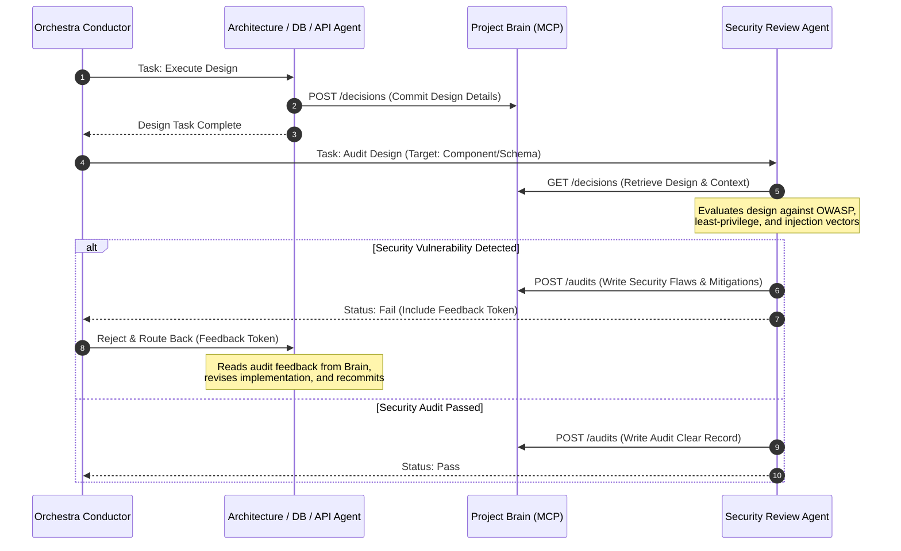

# Orchestra AI: Production-Grade System Architecture Design


Version: 1.0
Status: ✅ FROZEN
Owner: Orchestra AI
Sprint: Architecture Phase
Last Updated: July 2026

---

## Purpose

This document defines the high-level system architecture of Orchestra AI.

It is the authoritative reference for subsystem interactions, runtime boundaries, data flow, and deployment architecture.

Implementation must conform to this specification.

Major architectural changes require an Architecture Review before modification.

---

Orchestra AI is an advanced AI Engineering Studio that transforms high-level product ideas into production-ready software engineering blueprints. This document outlines the overall system architecture, agent collaboration paradigms, data flows, and integration patterns using **Google ADK (Agent Development Kit)**, **Antigravity agent paradigms**, **Model Context Protocol (MCP)**, **Agent Skills**, **Project Brain (Shared Memory MCP)**, and **Gemini**.

Designed for the Kaggle AI Agents Capstone, this architecture transitions the project from a simple conversational agent to a professional-grade multi-agent studio.

---

## 1. High-Level System Architecture

Orchestra AI follows a decoupled, event-driven, memory-centric architecture. The system is split into five distinct layers:

1. **Client Layer (The Studio)**: A web-based UI for visualizing agent workflows, executing runs, inspecting artifacts, tracking agent decisions, and providing human-in-the-loop (HITL) feedback.
2. **Orchestration & State Layer (The Core)**: Manages sessions, executes the Directed Acyclic Graph (DAG) using Google ADK, and controls the git-tracked workspace filesystem.
3. **Memory & Context Layer (Project Brain)**: A central, queryable memory store exposed via MCP that maintains structured decisions, reasoning paths, confidence scores, and artifact schemas.
4. **Specialized Agent Layer (The Orchestra)**: Dedicated, specialized AI agents powered by Gemini, each equipped with explicit Antigravity Agent Skills.
5. **Integration & Infrastructure Layer (The Platform)**: Standardizes tool and resource access using the Model Context Protocol (MCP), runs secure execution sandboxes, executes blueprint evaluations, and manages LLM gateways.

```mermaid
graph TB
    %% Client Layer
    subgraph Client Layer [1. Client Layer - Engineering Studio Web App]
        UI[Studio React/Next.js UI]
        DAG_Viz[Live DAG Executor Visualizer]
        Artifact_Prev[Live Artifact Generation Previewer]
        HITL_Console[Human Approval Console]
        Timeline[Agent Decision Timeline]
        Trace_Viewer[Execution Trace & Log Viewer]
    end

    %% Orchestration Layer
    subgraph Core Layer [2. Orchestration & State Layer]
        Engine[Orchestra Engine]
        GraphRunner[ADK Graph Executor]
        WorkspaceFS[(Shared Workspace Filesystem / git)]
    end

    %% Memory Layer
    subgraph Memory Layer [3. Memory & Context Layer]
        Brain[(Project Brain: Shared Memory MCP Store)]
    end

    %% Agent Layer
    subgraph Agent Layer [4. Specialized Agent Ecosystem]
        Conductor[Orchestra Conductor]
        Planner[Planning Agent]
        Arch[System Architecture Agent]
        DB[Database Design Agent]
        API[API Design Agent]
        Security[Security Review Agent]
        DevOps[DevOps & Deployment Agent]
        Doc[Documentation Agent]
    end

    %% Integration & Quality Gate Layer
    subgraph Integration Layer [5. Integration, Tooling & Infrastructure Layer]
        MCP_Gateway[MCP Gateway Server]
        Sandbox[Secure Docker Execution Sandbox]
        Evaluator[Evaluator Component]
        LLM_Gate[Gemini / Vertex AI API Gateway]
        QualityGate[Quality Gate Stage]
    end

    %% Client Connections
    UI <-->|WebSockets / gRPC| Engine
    Engine -->|State Stream| DAG_Viz & Artifact_Prev & Timeline & Trace_Viewer
    HITL_Console <-->|Approval Events| Engine

    %% Core Connections
    Engine <-->|Runs DAG| GraphRunner
    GraphRunner <--> WorkspaceFS

    %% Graph Runner / Agent Coordination
    GraphRunner <-->|Execute Agent Lifecycle| Conductor
    Conductor <-->|Delegate & Coordinate| Planner & Arch & DB & API & Security & DevOps & Doc

    %% Project Brain Connections
    Agent Layer <-->|Read / Write Decisions & State| Brain
    Brain <-->|Synch/Resolve References| WorkspaceFS

    %% Tooling / Sandbox / LLM
    Agent Layer <-->|Inference| LLM_Gate
    Agent Layer <-->|Tool Execution| MCP_Gateway
    MCP_Gateway <--> Sandbox
    
    %% Quality Gate Pipeline
    WorkspaceFS -->|Deliverable Bundle| QualityGate
    Brain -->|Decisions & Trace| QualityGate
    QualityGate -->|Security Audits| Security
    QualityGate -->|Scoring Validation| Evaluator
    QualityGate -->|Pass/Retry| Engine
```

---

## 2. Component breakdown

### 2.1 The Client Layer (Studio Frontend)
The frontend serves as an interactive IDE and dashboard for tracking agent processes.
* **Live DAG Execution Visualizer**: Renders the ADK execution graph in real-time. Nodes glow when running, turn green on success, red on failure, and yellow when waiting for review. Edge lines show dynamic data dependencies.
* **Live Artifact Generation Previewer**: A side-by-side split screen showing markdown, schemas, and diagrams (compiled Mermaid files) as agents write them to the workspace.
* **Human Approval Console**: Halts the graph runner at specific gates (e.g., PRD approval, database design sign-off) and provides a structured interface for users to approve, edit, or reject and provide textual feedback.
* **Timeline of Agent Decisions**: A chronological feed showing major choices made by the agents (e.g., "Database Agent selected PostgreSQL because relational integrity was prioritized in the PRD; Confidence Score: 95%").
* **Execution Trace Viewer**: A debugging console that lets developers inspect system-level outputs, prompt logs, token counts, and MCP tool call responses.

### 2.2 Orchestration & State Layer (The Core)
* **Orchestra Engine**: Orchestrates the backend lifecycle, coordinates web client sessions, and handles deployment boundaries.
* **ADK Graph Executor**: Implements the execution DAG. It handles dependencies, triggers parallel tasks (e.g., running Database and Architecture design in parallel), and routes control back to previous steps on verification failures.
* **Shared Workspace Filesystem**: A secure local directory backed by Git. Every agent modification results in an automated micro-commit. This ensures auditability and enables the engine to roll back files to a safe state if an evaluation step fails.

### 2.3 Memory & Context Layer: The Project Brain (Shared Memory MCP)
A critical issue in multi-agent systems is **context drift** and **token bloat**. If every agent passes its entire historical transcript to the next agent, prompt sizes grow exponentially, performance degrades, and agents lose focus.

The **Project Brain** acts as the central, structured database for system memory, implemented as an MCP Server:
* **Structured Records**: Instead of raw text logs, agents publish structured JSON payloads to the Project Brain containing:
  - **Decisions**: Technical choices (e.g., "Selected JWT over OAuth2 for simplicity").
  - **Reasoning**: Plain-text rationale and trade-offs analyzed.
  - **Confidence Scores**: Real value between 0.0 and 1.0 indicating how confident the agent is in this specific delivery.
  - **Artifact Pointers**: Absolute paths and hash-checksums of the files written in the workspace.
* **Targeted Context Injection**: When an agent launches, it does not receive the raw conversations of preceding agents. Instead, it queries the Project Brain for specific keys (e.g., the API Design Agent queries for `database_schema` and `system_architecture_decisions`). This reduces prompt sizes by up to 80% while enforcing strict consistency.
* **Traceability**: Changes to requirements, schemas, and architecture are linked together in a dependency tree stored in the Brain, making it easy to identify downstream impacts of a modification.

### 2.4 Specialized Agent Guilds
All agents are configured using Google ADK and powered by Gemini.
* **Orchestra Conductor**: The master coordinator. It parses user inputs, initializes the Project Brain, monitors task progress, orchestrates human approvals, and manages the execution flow.
* **Planning Agent**: Translates the product idea into functional software requirements, user personas, user stories, and a logical roadmap.
* **System Architecture Agent**: Designs the high-level system layout, details components, justifies tech stack selection, and renders architectural diagrams.
* **Database Design Agent**: Outlines schemas, indexes, keys, and entity relationships based on database requirements.
* **API Design Agent**: Formulates standard API specifications, outlining endpoints, methods, and response schemas.
* **Security Review Agent**: An audit agent acting as a dynamic quality gate (details in Section 4).
* **DevOps & Deployment Agent**: Builds containerization configurations and scripts the Infrastructure-as-Code blueprints.
* **Documentation Agent**: Pulls summaries from the Project Brain and structures the final README, guides, and developer roadmap.

### 2.5 Integration & Infrastructure Layer
* **MCP Gateway**: Exposes access control lists to the filesystem, sandboxes, and cloud tools.
* **Secure Docker Execution Sandbox**: An ephemeral container used to execute linters (e.g., `spectral` for OpenAPI, `sqlfluff` for SQL, `tflint` for Terraform) and verify syntax.
* **Evaluator**: A system-level validator that checks the final engineering bundle before release (details in Section 5).

---

## 3. Tech Stack Interaction Model

The interaction between **Google ADK**, **Antigravity Skills**, **MCP**, **Gemini**, and the **Project Brain** during a task execution cycle follows a precise hierarchy:

```
┌────────────────────────────────────────────────────────┐
│                      Google ADK                        │
│  - Sets up execution DAG & active task boundaries      │
│  - Routes execution control to target agent            │
└──────────────────────────┬─────────────────────────────┘
                           │
                           ▼
┌────────────────────────────────────────────────────────┐
│                   Antigravity Skills                   │
│  - Supplies agent context with SKILL.md instructions   │
│  - Resolves standard run-time scripts & examples       │
└──────────────────────────┬─────────────────────────────┘
                           │
                           ▼
┌────────────────────────────────────────────────────────┐
│                   Project Brain (MCP)                  │
│  - Retrieves structured state of previous agents       │
│  - Limits active context block size                    │
└──────────────────────────┬─────────────────────────────┘
                           │
                           ▼
┌────────────────────────────────────────────────────────┐
│                        Gemini                          │
│  - Consumes target context + system prompt + inputs    │
│  - Computes decisions, reasoning & artifact contents   │
└──────────────────────────┬─────────────────────────────┘
                           │
                           ▼
┌────────────────────────────────────────────────────────┐
│               Model Context Protocol (MCP)             │
│  - Writes files to Workspace Filesystem                │
│  - Submits structured JSON metadata to Project Brain   │
│  - Executes validation commands in Docker Sandbox      │
└────────────────────────────────────────────────────────┘
```

1. **Scheduling (Google ADK)**: The ADK triggers the next node in the workflow graph (e.g., `Database Design Task`).
2. **Context Setup (Antigravity Skills)**: The runner loads the agent configuration, pulling the associated **Agent Skills** (such as `database_modeling` skill). The prompt template is populated with guidelines from `SKILL.md`.
3. **Memory Retrieval (Project Brain)**: The agent invokes the Project Brain MCP tool to query data. It requests: `GET /decisions/architecture` and `GET /requirements/user_stories`. This injects precise, concise specifications into the context rather than raw chat history.
4. **Cognition (Gemini)**: The complete context is sent to the Gemini API. Gemini processes the files and generates the database schemas and ER diagrams, along with structured reasoning.
5. **Execution & Writing (MCP)**:
   - The agent writes the SQL schemas and diagrams directly to the workspace filesystem via the Filesystem MCP.
   - The agent writes a summary of its actions, confidence scores, and reasoning to the Project Brain via the memory MCP client (`POST /decisions/database`).
   - The agent invokes the sandbox MCP tool to run a linter check (`sqlfluff lint database_schema.sql`). If linting fails, it self-corrects based on compiler stdout before finishing.

---

## 4. Security Review Feedback Loop

True agentic reasoning requires multi-agent interaction, critique, and self-correction. Instead of running security analysis as a final check, the **Security Review Agent** operates as a dynamic feedback loop throughout the design phases.



### Demonstration of Agentic Reasoning
1. **Dynamic Review Context**: The Security Review Agent acts on specific checkpoints in the ADK graph. It reviews:
   - **System Architecture**: Inspects communication protocols (e.g., recommending HTTPS/WSS, TLS, API gateways, VPC boundaries).
   - **Database Schemas**: Scans for SQL injection patterns, lack of indexing on critical fields, missing audit fields, or exposure of PII (Personally Identifiable Information) without encryption.
   - **API Designs**: Audits CORS configurations, authentication headers, rate-limiting directives, and data leakage in responses.
   - **DevOps Blueprints**: Scans Dockerfiles for `root` execution, container privilege levels, and checks Terraform files for open ports (`0.0.0.0/0`) or hardcoded credentials.
2. **Structured Feedback & Self-Correction**: When the Security Agent fails a design, it writes a structured bug report containing the severity, file reference, line number, vulnerable design pattern, and suggested remediation. The target agent retrieves this report, updates its strategy, regenerates the files, and resubmits. This cycle repeats (up to a configured retry limit) without human intervention.

---

## 5. Automated Evaluation Stage

Before the Orchestra Studio bundles the final deliverables, the blueprint undergoes a strict, automated **Evaluation Stage** conducted by a dedicated non-agent component (The Evaluator).

The Evaluator calculates a weighted score across five core dimensions:

$$\text{Final Evaluation Score } (S) = w_1 C_m + w_2 C_s + w_3 S_c + w_4 D_q + w_5 D_p$$

Where:
* **$C_m$ (Completeness)**: Verifies that all 13 core deliverables are present and contain valid contents.
* **$C_s$ (Consistency)**: Validates that database schemas match the entities referenced in the API models, and that ports specified in Docker configs align with the Terraform infrastructure plan.
* **$S_c$ (Security)**: Confirms that all Security Audits in the Project Brain have a `Passed` status with no remaining unresolved flags.
* **$D_q$ (Documentation Quality)**: Checks markdown formatting, ensures Mermaid diagrams compile without syntax errors, and validates that all files contain correct file references.
* **$D_p$ (Deployability)**: Runs compilation/parsing checks in the sandbox on code blueprints (SQL, OpenAPI YAML, Terraform files, Dockerfiles).

```
┌────────────────────────────────────────────────────────┐
│                   Evaluation Gateway                   │
├────────────────────────────────────────────────────────┤
│  Is Score (S) >= 8.5/10.0?                             │
├──────────────────────────┬─────────────────────────────┤
│            YES           │              NO             │
│            ▼             │              ▼              │
│ ┌──────────────────────┐ │    ┌──────────────────────┐ │
│ │   Bundle Released    │ │    │  Returned to Conductor│ │
│ │   - Git tagged       │ │    │  - Error log created │ │
│ │   - ZIP packaged     │ │    │  - Node rerun triggered│ │
│ └──────────────────────┘ │    └──────────────────────┘ │
└──────────────────────────┴─────────────────────────────┘
```

---

## 6. Engineering Blueprint Deliverables

The final product of the studio is a structured directory containing 13 core files. This bundle constitutes the complete system blueprint:

```
workspace/
├── 01_prd.md                       # Product Requirements Document
├── 02_user_stories.md              # User Stories & Acceptance Criteria
├── 03_architecture_design.md       # System Architecture & Component Design
├── 04_system_flow.mermaid          # Mermaid System Flow / Sequence Diagrams
├── 05_database_schema.sql          # Relational Database DDL Schema
├── 06_er_diagram.mermaid           # Entity-Relationship diagram
├── 07_openapi_specification.yaml   # API Contracts & Endpoint Specifications
├── 08_infrastructure_plan.md       # Multi-Region Deployment & Cloud Architecture
├── 09_Dockerfile                   # Optimized Container Configuration
├── 10_main.tf                      # Terraform Infrastructure Code
├── 11_security_audit_report.md     # Security Threat Model & Compliance Log
├── 12_README.md                    # System Bootstrapping & Setup Instructions
└── 13_development_roadmap.md       # Iterative Implementation Milestone Plan
```

### Deliverable Specifications

1. **Product Requirements Document (PRD)**: Outlines the product vision, scope, target audience, core features, functional specifications, and non-functional requirements (performance, scalability, reliability).
2. **User Stories**: Written in Gherkin-compatible formats (`Given-When-Then`) detailing acceptance criteria for every functional milestone.
3. **Architecture Document**: Documents the architectural patterns (e.g., microservices, MVC, event-driven), caching layers, messaging brokers, and technology rationale.
4. **Mermaid Architecture Diagram**: An interactive sequence/flow diagram showing user actions, API gateways, service calls, and backend storage writes.
5. **Database Schema**: Full DDL script including table constraints, primary/foreign keys, lookup tables, and index definitions optimized for query profiles.
6. **ER Diagram**: Visual layout displaying table relations, cardinality (one-to-many, many-to-many), and table attributes.
7. **OpenAPI Specification**: A fully compliant OpenAPI 3.0/3.1 contract specifying endpoints, request headers, path parameters, query strings, request bodies, and standard JSON HTTP status responses.
8. **Infrastructure Plan**: Defines network topologies, subnet divisions, CDN integrations, VPC peering, secrets management, and monitoring/logging stacks.
9. **Docker Configuration**: Production-grade multi-stage build Dockerfiles, utilizing non-root users, lightweight base images (e.g., alpine/distroless), and proper caching layers.
10. **Terraform Blueprint**: Standardized infrastructure code defining cloud providers, resources (e.g., database instances, container registries, load balancers), variables, and output values.
11. **Security Report**: Contains a threat modeling review mapping security vulnerabilities, compliance strategies (e.g., GDPR, HIPAA if applicable), and details of the Security Review Agent loops.
12. **README**: Explains how to set up the dev environment, spin up the Docker containers, configure environment variables, run database migrations, and execute tests.
13. **Development Roadmap**: A step-by-step development roadmap divided into milestones (e.g., MVP, V1, Scaling Phase) with clear definitions of done (DoD) for each step.
---

# Architecture Freeze

This document is frozen.

It serves as the architectural contract for Orchestra AI.

Changes require:

- Architecture Review
- Architecture Decision Record (ADR)
- Version increment

Architecture Phase: Complete
